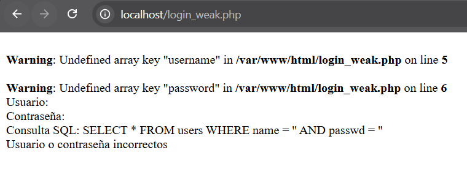
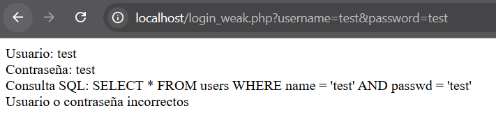
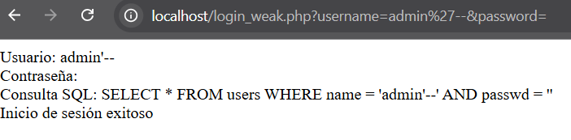
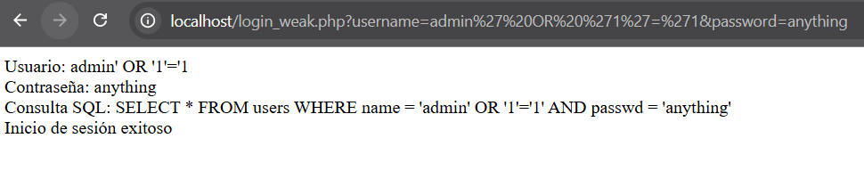
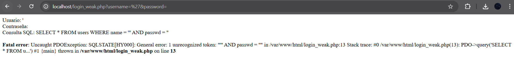
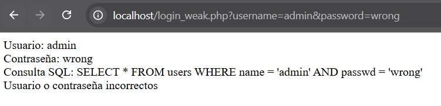

# Broken Authentication 

Broken Authentication ocurre cuando un atacante puede eludir o forzar los mecanismos de autenticación debido a debilidades en la implementación del sistema. Esto puede incluir credenciales débiles, almacenamiento inseguro de contraseñas, gestión inadecuada de sesiones y falta de protección contra ataques de fuerza bruta.

---

## Vulnerabilidad 1: Acceso sin Parámetros

**Vulnerabilidad:** Information Disclosure vía PHP warnings. Muestra el path interno (`/var/www/html/login_weak.php`), leak de estructura de BD y query SQL vacía. Facilita fingerprinting para ataques dirigidos.

**Impacto:** Reconocimiento (OWASP A05:2021 — Security Misconfiguration). El atacante mapea el entorno sin esfuerzo.

**Mitigación:**

```php
error_reporting(0);
ini_set('display_errors', 0);
ini_set('log_errors', 1);

if (!isset($_POST['username']) || !isset($_POST['password'])) {
    die("Credenciales requeridas");
}
```



---

## Vulnerabilidad 2: Parámetros Normales GET

**Vulnerabilidad:** Exposición de credenciales en claro + SQL query visible en la respuesta HTML. Muestra `Usuario: test`, `Contraseña: test` y la query completa.

**Impacto:** Shoulder surfing, log harvesting, credential reuse attacks.

**Mitigación:**

```php
// Nunca mostrar inputs sensibles en el output HTML
// Correcto: no incluir $username ni $password en ningún echo

// Solo mostrar información de debug si el entorno lo requiere explícitamente
if (isset($_ENV['DEBUG']) && $_ENV['DEBUG'] === 'true') {
    echo "Debug: $query"; // Solo en entorno de desarrollo
}
// En PROD: $_ENV['DEBUG'] debe ser false o estar ausente
```



> **Nota:** El fix fundamental es no hacer `echo` de las credenciales recibidas en ningún punto del flujo de producción. El `unset()` post-proceso no impide que los datos ya hayan sido emitidos al cliente.

---

## Vulnerabilidad 3: SQLi Tautology + Comment

**Vulnerabilidad:** SQL Injection crítica. El payload `admin'--` transforma la query en:

```sql
SELECT * FROM users WHERE name='admin'--' AND passwd=''
```

El comentario `--` anula la comprobación de contraseña, logrando bypass de login exitoso.

**Impacto:** Acceso no autorizado como administrador (CVSS 9.1). Escalada total de privilegios.

**Mitigación:**

```php
$stmt = $db->prepare("SELECT COUNT(*) FROM users WHERE name = ? AND passwd = ?");
$stmt->execute([$_POST['username'], $_POST['password']]);

if ($stmt->fetchColumn() > 0) {
    // login exitoso
}

$db->setAttribute(PDO::ATTR_EMULATE_PREPARES, false);
```



---

## Vulnerabilidad 4: SQLi Universal Tautology

**Vulnerabilidad:** SQLi avanzada. El payload `admin' OR '1'='1` genera una condición siempre TRUE, logrando bypass total independientemente de la contraseña.

**Impacto:** Acceso ilimitado a cualquier usuario existente. Base para ataques UNION con dump de datos.

**Mitigación:** Prepared statements (ver Captura 3) + whitelist de entrada:

```php
$username = preg_replace('/[^a-zA-Z0-9_-]/', '', $_POST['username']);

if (strlen($username) > 20) {
    die("Username inválido");
}
```



> **Nota:** La sanitización con `preg_replace` actúa como capa de defensa en profundidad, pero los **prepared statements son la mitigación primaria e imprescindible**. La sanitización por sí sola es insuficiente.

---

## Vulnerabilidad 5: Error SQL Disclosure

**Vulnerabilidad:** Error SQL completo expuesto al usuario (`no such table: WHERE`). Confirma la existencia de la tabla `users` y expone internos del parsing de SQLite.

**Impacto:** Enumeración del esquema de la BD para construir ataques más refinados.

**Mitigación:**

```php
try {
    $result = $db->query($query);
} catch (PDOException $e) {
    error_log("SQL Error: " . $e->getMessage()); // Solo en logs internos
    die("Error de autenticación");               // Mensaje genérico al usuario
}
```



---

## Vulnerabilidad 6: Enumeración de Usuario Válido

**Vulnerabilidad:** Diferenciación entre usuario válido e inexistente. `admin` + contraseña incorrecta → query limpia sin error; usuario inválido → excepción SQL. Las diferencias de timing y respuesta permiten brute force de usernames.

**Impacto:** Username enumeration — resuelve el 50% del trabajo necesario para un ataque de fuerza bruta.

**Mitigación:**

```php
// Respuesta uniforme SIEMPRE, independientemente del resultado
$message = "Usuario o contraseña incorrectos";
echo $message; // Idéntica tanto si el user existe como si no

// Delay aleatorio para dificultar timing attacks
usleep(rand(100000, 300000)); // 100–300 ms
```


---

## Resumen

| # | Tipo Vulnerabilidad | Payload | CVSS | Fix Principal |
|---|---|---|---|---|
| 1 | Info Disclosure | Sin params | 5.3 | `display_errors=0` |
| 2 | Credential Exposure | `test/test` | 7.5 | No hacer echo de inputs |
| 3 | SQLi Bypass | `admin'--` | 9.1 | Prepared statements |
| 4 | SQLi Universal | `' OR 1=1` | 9.1 | Input sanitization + prepared statements |
| 5 | SQL Error Leak | `'` solo | 7.5 | Try-catch con logging interno |
| 6 | User Enumeration | `admin` vs `'` | 6.5 | Respuestas uniformes + delay aleatorio |
