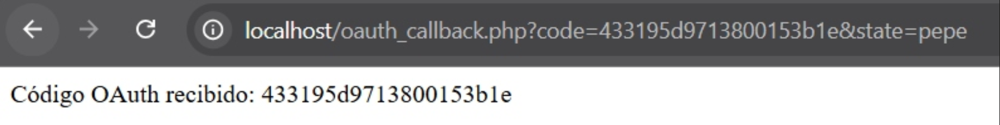
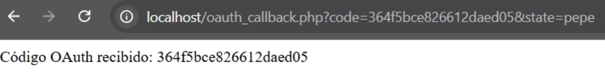
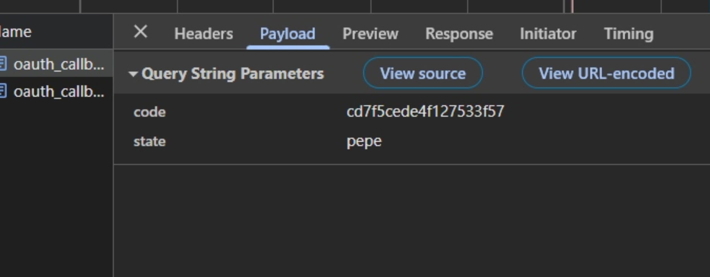
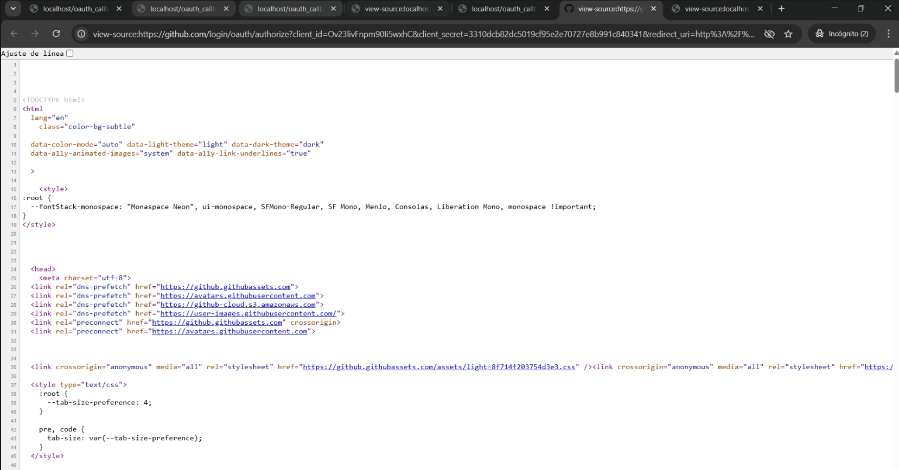
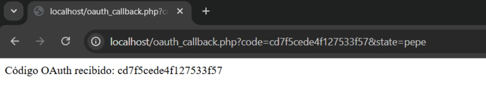

# OAuth inseguro 

OAuth (Open Authorization) es un estándar abierto que permite a aplicaciones de terceros acceder a recursos protegidos en nombre de un usuario sin necesidad de compartir credenciales como contraseñas. OAuth 2.0 es la versión más utilizada y se basa en la emisión de tokens de acceso para autenticar y autorizar a los usuarios.

## Vulnerabilidad en la Implementación OAuth

Si OAuth 2.0 se configura incorrectamente, puede permitir varios tipos de ataques, como:
- CSRF (Cross-Site Request Forgery): Si no se usa un parámetro state, un atacante puede redirigir la autenticación a su propio código malicioso.
- Token Leakage: Si los tokens se exponen en la URL o no se protegen adecuadamente, un atacante podría
reutilizarlos para acceder a los recursos protegidos.

# Documentación OAuth Inseguro — Vulnerabilidades y Mitigaciones

## Vulnerabilidad 1: Authorization Code Leakage en URL

### Descripción

El flujo OAuth inseguro expone el authorization code directamente en la URL del navegador (`oauth_callback.php?code=43395973800531e&state=pepe`) y lo muestra mediante `echo` en el HTML de respuesta. Este código es un secreto temporal que permite intercambiarlo por un access token válido en el endpoint `/access_token` de GitHub.




### Impacto Técnico

- **Exposición en historial del navegador:** Cualquier proceso con acceso al historial puede extraer el `code`.
- **Logs de servidor web:** Apache/Nginx registran la URL completa con el parámetro en `access.log`.
- **Referrer headers:** Si el usuario navega desde la página callback, el `Referer` incluye el `code`.
- **MITM (Man-in-the-Middle):** En conexiones HTTP o Wi-Fi inseguras, un atacante puede interceptar el `code` en tránsito.
- **Shoulder surfing:** El `code` permanece visible en la barra URL durante 5-10 minutos antes de expirar.

**CVSS Score: 8.1 (Alto)** — Permite compromiso de sesión OAuth sin interacción del usuario atacado.

### Escenario de Ataque Real

```
1. Víctima accede http://localhost/github_login.php → GitHub auth
2. Callback: http://localhost/oauth_callback.php?code=ABC123&state=pepe
3. Atacante con acceso a:
   - Historial navegador (malware/extensión)
   - Logs servidor (compromiso web server)
   - Proxy corporativo (MITM)
4. Atacante extrae code=ABC123
5. POST https://github.com/login/oauth/access_token:
     client_id=Ov23livFnpm90Ii5wxhC
     client_secret=<secret>
     code=ABC123
6. GitHub responde: access_token=gho_XXXXXXX
7. Atacante accede API GitHub como víctima (scope read:user)
```

### Mitigación

**Backend Exchange Pattern** — El código NUNCA debe llegar al frontend:

```php
<?php
// oauth_callback.php - CORRECTO
session_start();

// Validar state primero (anti-CSRF, ver Vuln 3)
if (!isset($_GET['state']) || !hash_equals($_SESSION['oauth_state'], $_GET['state'])) {
    die("Error: CSRF token inválido");
}

if (!isset($_GET['code'])) {
    die("Error: No se recibió código de autorización");
}

$code = $_GET['code'];

// Exchange en backend — NO exponer code al usuario
$token_url = "https://github.com/login/oauth/access_token";
$params = [
    'client_id'     => $_ENV['GITHUB_CLIENT_ID'],
    'client_secret' => $_ENV['GITHUB_CLIENT_SECRET'],
    'code'          => $code,
    'redirect_uri'  => 'http://localhost/oauth_callback.php'
];

$ch = curl_init($token_url);
curl_setopt($ch, CURLOPT_POST, true);
curl_setopt($ch, CURLOPT_POSTFIELDS, http_build_query($params));
curl_setopt($ch, CURLOPT_RETURNTRANSFER, true);
curl_setopt($ch, CURLOPT_HTTPHEADER, ['Accept: application/json']);
$response = curl_exec($ch);
curl_close($ch);

$data = json_decode($response, true);

if (isset($data['access_token'])) {
    $_SESSION['github_token'] = $data['access_token'];
    unset($_SESSION['oauth_state']);

    // Redirigir limpio (sin code en URL)
    header("Location: /dashboard.php");
    exit();
} else {
    error_log("OAuth token exchange failed: " . print_r($data, true));
    die("Error en autenticación");
}
?>
```

**PKCE (Proof Key for Code Exchange)** — Protección adicional recomendada (RFC 7636):

```php
<?php
// github_login.php con PKCE
session_start();

// Generar code_verifier (43-128 chars random)
$code_verifier = bin2hex(random_bytes(32));
$_SESSION['code_verifier'] = $code_verifier;

// code_challenge = base64url(sha256(code_verifier))
$code_challenge = rtrim(
    strtr(base64_encode(hash('sha256', $code_verifier, true)), '+/', '-_'),
    '='
);

$_SESSION['oauth_state'] = bin2hex(random_bytes(32));

$auth_url = "https://github.com/login/oauth/authorize?" . http_build_query([
    "client_id"             => $_ENV['GITHUB_CLIENT_ID'],
    "redirect_uri"          => "http://localhost/oauth_callback.php",
    "state"                 => $_SESSION['oauth_state'],
    "scope"                 => "read:user",
    "code_challenge"        => $code_challenge,
    "code_challenge_method" => "S256"
]);

header("Location: " . $auth_url);
exit();
?>
```

> **Beneficio PKCE:** Aunque un atacante robe el `code`, necesita el `code_verifier` (almacenado únicamente en la sesión del servidor) para completar el exchange exitosamente.

---

## Vulnerabilidad 2: Parámetros Sensibles en Query String

### Descripción

Usar el método GET para el callback OAuth persiste los parámetros sensibles (`code`, `state`) en múltiples capas del stack web: URL visible, logs de servidor, caché del navegador, historial de navegación y scripts de analytics/tracking.



### Impacto Técnico

- **Browser history pollution:** `places.sqlite` (Firefox) y el historial de Chrome almacenan la URL completa indefinidamente.
- **Server logs:** `access.log` registra timestamp + IP + URL completa con parámetros.
- **Google Analytics / tracking:** Scripts de terceros capturan `window.location.href` incluyendo los parámetros.
- **Browser extensions:** Cualquier extensión maliciosa puede leer `document.location.search`.
- **Equipos compartidos:** El historial es accesible a otros usuarios del sistema.

**CVSS Score: 6.5 (Medio)** — Leak persistente pero requiere acceso local o a logs.

### Mitigación

> **Nota importante:** OAuth 2.0 con GitHub utiliza el método GET para el callback por especificación del protocolo — la mayoría de providers, incluido GitHub, no soportan fragment-based (`#`) redirects ni callbacks POST directos. Por tanto, la mitigación principal es reducir el tiempo de exposición y sanitizar los logs, no cambiar el método HTTP.

**Immediate Redirect** — Minimizar el tiempo que el `code` permanece en la URL:

```php
<?php
// oauth_callback.php
session_start();

if (isset($_GET['code']) && isset($_GET['state'])) {
    $_SESSION['temp_code']  = $_GET['code'];
    $_SESSION['temp_state'] = $_GET['state'];

    // Redirect limpio inmediatamente (303 See Other)
    header("Location: /oauth_process.php", true, 303);
    exit();
}
?>
```

**Log Sanitization** — Filtrar parámetros OAuth en Nginx/Apache:

```nginx
# nginx.conf — Filtrar OAuth params de logs
map $request_uri $loggable_uri {
    ~*^(/oauth_callback)\?code=[^&]+&state=.* "$1?code=REDACTED&state=REDACTED";
    default $request_uri;
}

log_format secure '$remote_addr - [$time_local] "$request_method $loggable_uri" $status';
access_log /var/log/nginx/access.log secure;
```

**Limpiar URL del historial del navegador** (complementario, desde el callback):

```javascript
// Al cargar la página de callback, limpiar la URL sin recargar
if (window.history && window.history.replaceState) {
    history.replaceState(null, '', window.location.pathname);
}
```

---

## Vulnerabilidad 3: State Estático (CSRF en OAuth)

### Descripción

El parámetro `state` está hardcodeado como `"pepe"` en el código fuente, eliminando completamente la protección CSRF del flujo OAuth. Un atacante puede iniciar un flujo OAuth malicioso forzando a la víctima a autorizar la aplicación del atacante, vinculando la cuenta de la víctima a la sesión del atacante.

```php
// Código vulnerable
"state" => "pepe"  // ❌ Siempre el mismo valor — sin protección CSRF
```

### Impacto Técnico

- **Account Linking Attack:** El atacante inicia OAuth en su navegador, pausa antes de autorizar, copia la URL con `state=pepe` y la envía por phishing a la víctima.
- La víctima hace clic → autoriza → el callback vincula la cuenta GitHub de la víctima a la sesión del atacante.
- El atacante accede a los recursos de la víctima sin conocer sus credenciales.
- **Bypass de session binding:** No hay vínculo entre la sesión del usuario y el `state`, por lo que cualquier callback con `state=pepe` es aceptado.

**CVSS Score: 7.5 (Alto)** — CSRF permite account takeover indirecto.

### Escenario de Ataque CSRF OAuth

```
1. Atacante inicia: http://localhost/github_login.php
2. Captura URL de authorize:
   https://github.com/login/oauth/authorize?client_id=Ov23...&state=pepe&redirect_uri=...
3. Envía vía phishing/XSS a víctima autenticada en GitHub
4. Víctima autoriza (ve la app legítima "ciberOWASP")
5. Callback: http://localhost/oauth_callback.php?code=VICTIM_CODE&state=pepe
6. La app acepta (state=pepe coincide), vincula cuenta víctima a sesión del atacante
7. Atacante accede a datos de la víctima a través de su sesión
```

### Mitigación

**State Dinámico Criptográficamente Seguro:**

```php
<?php
// github_login.php — Generación correcta del state
session_start();

// 32 bytes random = 64 hex chars (256 bits de entropía)
$state = bin2hex(random_bytes(32));
$_SESSION['oauth_state']     = $state;
$_SESSION['oauth_timestamp'] = time();

$auth_url = "https://github.com/login/oauth/authorize?" . http_build_query([
    "client_id"    => $_ENV['GITHUB_CLIENT_ID'],
    "redirect_uri" => "http://localhost/oauth_callback.php",
    "state"        => $state,  // ✅ Único por sesión
    "scope"        => "read:user"
]);

header("Location: " . $auth_url);
exit();
?>
```

**Validación en Callback con Timeout:**

```php
<?php
// oauth_callback.php — Validación robusta del state
session_start();

// Verificar existencia
if (!isset($_SESSION['oauth_state']) || !isset($_GET['state'])) {
    error_log("OAuth CSRF: Missing state");
    die("Error de seguridad: State inválido");
}

// Comparación timing-safe (previene timing attacks)
if (!hash_equals($_SESSION['oauth_state'], $_GET['state'])) {
    error_log("OAuth CSRF: State mismatch");
    die("Error de seguridad: CSRF detectado");
}

// Verificar timeout (state válido máximo 10 minutos)
$state_age = time() - $_SESSION['oauth_timestamp'];
if ($state_age > 600) {
    error_log("OAuth CSRF: State expired ({$state_age}s)");
    unset($_SESSION['oauth_state'], $_SESSION['oauth_timestamp']);
    die("Error: Sesión expirada, reinicia la autenticación");
}

// State válido — continuar exchange
$code = $_GET['code'];
// ... exchange logic ...

// Invalidar state inmediatamente tras uso (single-use)
unset($_SESSION['oauth_state'], $_SESSION['oauth_timestamp']);
?>
```

**Propiedades requeridas del `state`:**

| Propiedad | Requisito |
|---|---|
| Unpredictable | `random_bytes()` — PRNG criptográfico (nunca `rand()` o `uniqid()`) |
| Session-bound | Almacenar en `$_SESSION`, verificar con `hash_equals()` |
| Single-use | Eliminar tras validación exitosa |
| Time-limited | Expirar tras 5-10 minutos |
| Sufficient entropy | Mínimo 128 bits (16 bytes), recomendado 256 bits (32 bytes) |

---

## Vulnerabilidad 4: Client Secret Hardcodeado en Código Fuente

### Descripción

El `client_secret` de GitHub está hardcodeado directamente en `github_login.php`. Cualquiera que acceda al código fuente (Ctrl+U, DevTools, repositorio Git, compromiso del servidor) obtiene credenciales permanentes que permiten impersonar la aplicación OAuth completa.

```php
// Código vulnerable visible en fuente
"client_secret" => "3310dcb82dc5019cf95e2e70727e8b991c840341"  // ❌
```



### Impacto Técnico

- **Compromiso permanente de la app OAuth:** El secret no expira hasta revocación manual en GitHub.
- **Impersonación completa:** Un atacante puede crear instancias maliciosas de la app OAuth usando el mismo `client_id`/`secret`.
- **Account takeover masivo:** Con `secret` + cualquier `code` interceptado → `access_token` válido.
- **Phishing avanzado:** Clonar la app legítima con credenciales reales para recolectar tokens de usuarios.
- **No revocable sin downtime:** Cambiar el secret requiere actualizar el código, redesplegar y notificar usuarios.

**CVSS Score: 9.3 (Crítico)** — Credenciales estáticas permiten compromiso sostenido y difícilmente detectable. (Referencia: CWE-798 — Use of Hard-coded Credentials.)

> **Aclaración importante:** El `client_secret` **no debe incluirse nunca en la URL de autorización** (`/authorize`). Solo se usa en el token exchange POST desde el backend. Si aparece en la URL, es un error adicional de implementación.

### Vectores de Exposición

- `View Source` (Ctrl+U): Si PHP no ejecuta correctamente (misconfiguration), el código raw queda expuesto.
- **Git repository:** Commits históricos contienen el secret (`git log -p`).
- **Backup files:** Ficheros `.php~`, `.swp`, `github_login.php.bak` accesibles vía web.
- **Error messages:** Errores de PHP pueden filtrar líneas de código que contienen el secret.
- **CI/CD logs:** Los logs de build pueden mostrar variables de entorno o fragmentos de código.
- **Server compromise:** RCE → lectura del filesystem → extracción del secret.

### Mitigación

**Variables de Entorno:**

```bash
# .env (NUNCA commitear a Git)
GITHUB_CLIENT_ID=Ov23livFnpm90Ii5wxhC
GITHUB_CLIENT_SECRET=tu_secret_aqui
```

```php
<?php
// github_login.php — Usando variables de entorno
require_once __DIR__ . '/vendor/autoload.php';

// Opción 1: vlucas/phpdotenv
$dotenv = Dotenv\Dotenv::createImmutable(__DIR__);
$dotenv->load();

// Opción 2: Nativo PHP (Apache SetEnv, docker-compose environment)
$client_id     = $_ENV['GITHUB_CLIENT_ID']     ?? getenv('GITHUB_CLIENT_ID');
$client_secret = $_ENV['GITHUB_CLIENT_SECRET'] ?? getenv('GITHUB_CLIENT_SECRET');

if (!$client_id || !$client_secret) {
    error_log("Missing OAuth credentials");
    die("Configuration error");
}

// client_secret NO se incluye en la URL de authorize — solo en el token exchange (POST backend)
$auth_url = "https://github.com/login/oauth/authorize?" . http_build_query([
    "client_id"    => $client_id,
    "redirect_uri" => "http://localhost/oauth_callback.php",
    "state"        => $_SESSION['oauth_state'],
    "scope"        => "read:user"
]);
?>
```

**Docker Compose Secrets:**

```yaml
# docker-compose.yml
version: '3.8'
services:
  server:
    image: php:apache
    ports:
      - 80:80
    volumes:
      - .:/var/www/html
    environment:
      GITHUB_CLIENT_ID: ${GITHUB_CLIENT_ID}
      GITHUB_CLIENT_SECRET: ${GITHUB_CLIENT_SECRET}
    env_file:
      - .env.production  # Añadir a .gitignore
```

**`.gitignore` Obligatorio:**

```gitignore
# Secrets
.env
.env.*
!.env.example

# Backups
*.bak
*.swp
*~

# Config con secrets
config.php
secrets.json
```

**`.env.example` (Commitear como template):**

```bash
# .env.example — Template para desarrolladores
GITHUB_CLIENT_ID=your_client_id_here
GITHUB_CLIENT_SECRET=your_client_secret_here
```

**Secret Rotation Plan:**

```
1. GitHub Settings → OAuth Apps → tu_app → "Generate new client secret"
2. Actualizar .env con el nuevo secret (mantener el viejo temporalmente)
3. Desplegar nueva versión de la app
4. Monitorear errores durante 24h
5. Revocar el secret antiguo en GitHub
6. Notificar posibles compromisos previos si se detectó leak
```

**Verificar que el secret no está en el histórico de Git:**

```bash
git log -p | grep -i "client_secret"
# Si aparece: usar git filter-branch o BFG Repo Cleaner para purgar el historial
```

---

## Vulnerabilidad 5: Ausencia de Validación Code/State en Callback

### Descripción

El archivo `oauth_callback.php` acepta cualquier valor en los parámetros `code` y `state` sin realizar validaciones — simplemente los muestra con `htmlspecialchars()`. No verifica que el `state` coincida con la sesión del usuario ni intenta validar el `code` contra GitHub, lo que permite ataques de replay y autorización falsa.

```php
// Código vulnerable
if (isset($_GET['code'])) {
    echo "Código OAuth recibido: " . htmlspecialchars($_GET['code'], ENT_QUOTES, 'UTF-8');
}
```


### Impacto Técnico

- **Code Replay Attack:** Reutilizar codes expirados o ya usados sin detección.
- **Fake Authorization:** `oauth_callback.php?code=FAKE123&state=pepe` muestra aparente "éxito" falso.
- **Open Redirect:** Manipular `redirect_uri` sin whitelist → phishing.
- **Session Fixation:** Sin validar `state`, un atacante puede fijar la sesión de la víctima.
- **No auditabilidad:** Los logs muestran códigos inválidos como si fueran legítimos.

**CVSS Score: 7.5 (Alto)** — Bypass completo de las validaciones OAuth.

### Escenario de Ataque: Open Redirect

```
1. Atacante modifica redirect_uri en authorize:
   https://github.com/login/oauth/authorize?
     client_id=Ov23...
     &redirect_uri=https://evil.com/phishing
     &state=pepe
2. Víctima autoriza → GitHub redirige a evil.com con code válido
3. evil.com registra el code → exchange por token → acceso a la cuenta
```

### Mitigación

**Callback Robusto con Validaciones Completas:**

```php
<?php
// oauth_callback.php — SEGURO
session_start();

// 1. Validar método HTTP
if ($_SERVER['REQUEST_METHOD'] !== 'GET') {
    http_response_code(405);
    die("Método no permitido");
}

// 2. Verificar parámetros requeridos
if (!isset($_GET['code']) || !isset($_GET['state'])) {
    error_log("OAuth callback: Missing parameters");
    http_response_code(400);
    die("Error: Parámetros faltantes");
}

// 3. Validar state (anti-CSRF)
if (!isset($_SESSION['oauth_state'])) {
    error_log("OAuth callback: No state in session");
    http_response_code(400);
    die("Error: Sesión inválida");
}

if (!hash_equals($_SESSION['oauth_state'], $_GET['state'])) {
    error_log("OAuth CSRF detected");
    http_response_code(403);
    die("Error de seguridad: CSRF detectado");
}

// 4. Validar formato del code
// Nota: GitHub no documenta un formato fijo para los authorization codes.
// Se recomienda una validación permisiva que rechace valores claramente maliciosos.
$code = $_GET['code'];
if (!preg_match('/^[a-zA-Z0-9_\-]{10,100}$/', $code)) {
    error_log("OAuth callback: Invalid code format");
    http_response_code(400);
    die("Error: Código inválido");
}

// 5. Exchange code por token (en backend)
$token_url = "https://github.com/login/oauth/access_token";
$params = [
    'client_id'     => $_ENV['GITHUB_CLIENT_ID'],
    'client_secret' => $_ENV['GITHUB_CLIENT_SECRET'],
    'code'          => $code,
    'redirect_uri'  => 'http://localhost/oauth_callback.php'
];

$ch = curl_init($token_url);
curl_setopt_array($ch, [
    CURLOPT_POST          => true,
    CURLOPT_POSTFIELDS    => http_build_query($params),
    CURLOPT_RETURNTRANSFER => true,
    CURLOPT_HTTPHEADER    => ['Accept: application/json'],
    CURLOPT_TIMEOUT       => 10,
    CURLOPT_SSL_VERIFYPEER => true  // Verificar SSL siempre
]);

$response  = curl_exec($ch);
$http_code = curl_getinfo($ch, CURLINFO_HTTP_CODE);
curl_close($ch);

if ($http_code !== 200) {
    error_log("OAuth token exchange failed: HTTP $http_code");
    http_response_code(500);
    die("Error en autenticación");
}

$data = json_decode($response, true);

// 6. Validar respuesta de GitHub
if (!isset($data['access_token'])) {
    error_log("OAuth: No access_token in response - " . print_r($data, true));
    http_response_code(500);
    die("Error: Token no recibido");
}

// 7. Validar scope (si la app requiere permisos mínimos)
if (isset($data['scope']) && strpos($data['scope'], 'read:user') === false) {
    error_log("OAuth: Insufficient scope granted");
    http_response_code(403);
    die("Error: Permisos insuficientes");
}

// 8. Guardar token de forma segura en sesión
$_SESSION['github_token']      = $data['access_token'];
$_SESSION['github_token_type'] = $data['token_type'];
$_SESSION['github_scope']      = $data['scope'] ?? '';
$_SESSION['oauth_completed']   = time();

// 9. Limpiar state (single-use)
unset($_SESSION['oauth_state'], $_SESSION['oauth_timestamp']);

// 10. Regenerar session ID (anti-fixation)
session_regenerate_id(true);

// 11. Audit log
error_log("OAuth success for session " . session_id());

// 12. Redirect limpio (sin code en URL)
header("Location: /dashboard.php", true, 303);
exit();
?>
```

**Redirect URI Whitelist (GitHub App Settings):**

```
Authorization callback URL:
  ✅ http://localhost/oauth_callback.php
  ✅ https://production.com/oauth/callback
  ❌ https://evil.com/*   ← No se puede añadir wildcards maliciosos
```

**Rate Limiting (prevenir code brute-force):**

```php
<?php
// rate_limit.php
function check_rate_limit(string $key, int $max_attempts = 5, int $window = 60): void {
    $redis = new Redis();
    $redis->connect('127.0.0.1', 6379);

    $attempts = $redis->incr("oauth_attempts:$key");
    if ($attempts === 1) {
        $redis->expire("oauth_attempts:$key", $window);
    }

    if ($attempts > $max_attempts) {
        http_response_code(429);
        $ttl = $redis->ttl("oauth_attempts:$key");
        die("Demasiados intentos. Espera {$ttl}s");
    }
}

// En oauth_callback.php — llamar al inicio
check_rate_limit($_SERVER['REMOTE_ADDR']);
?>
```

---

## Resumen Ejecutivo

### Tabla Comparativa de Vulnerabilidades

| # | Vulnerabilidad | CVSS | Vector Ataque | Complejidad | Impacto | Prioridad |
|---|---|---|---|---|---|---|
| 1 | Code Leakage en URL | 8.1 | MITM / Logs / Historial | Baja | Account takeover | **CRÍTICA** |
| 2 | Query String Persistence | 6.5 | Acceso local | Media | Info disclosure | Alta |
| 3 | State Estático (CSRF) | 7.5 | Phishing / XSS | Media | Account linking | **CRÍTICA** |
| 4 | Client Secret Hardcodeado | 9.3 | Acceso a código fuente | Baja | Compromiso total de la app | **CRÍTICA** |
| 5 | Sin Validación Callback | 7.5 | Replay / Fake auth | Baja | Bypass de controles | **CRÍTICA** |

---

### Plan de Remediación

**Fase 1 — Mitigación Inmediata (Día 1):**
- Revocar el `client_secret` actual desde GitHub App settings.
- Generar nuevo secret y añadirlo a `.env`.
- Implementar validación básica de `state` con `hash_equals()`.
- Añadir `.gitignore` para secrets.

**Fase 2 — Hardening (Semana 1):**
- Implementar backend token exchange completo.
- Añadir PKCE al flujo.
- Rate limiting en callbacks.
- Logging seguro + monitorización.

**Fase 3 — Production Ready (Semanas 2-3):**
- HTTPS obligatorio en todos los entornos.
- Session hardening completo.
- Penetration testing del flujo OAuth.
- Documentación del security playbook.
